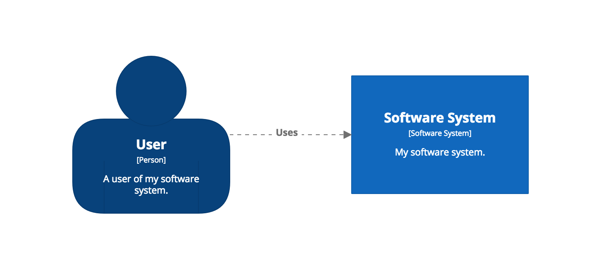
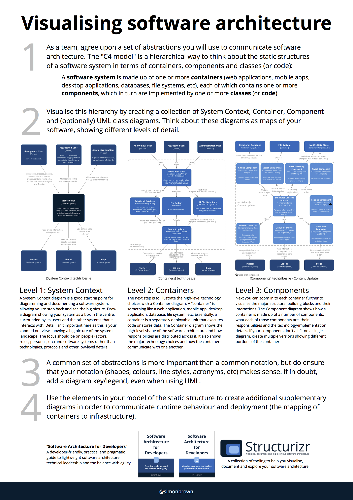

# Structurizr for Java

This GitHub repository is a collection of tooling to help you visualise, document and explore the software architecture of a software system. In summary, it allows you to create a software architecture model based upon Simon Brown's [C4 model](docs/c4.md) using Java code, and then export that model to be visualised using tools such as:

1. [Structurizr](https://structurizr.com): a web-based software as a service and on-premises product to render software architecture diagrams and supplementary Markdown/AsciiDoc documentation.
1. [PlantUML](docs/plantuml.md): a tool to create UML diagrams using a simple textual domain specific language.
1. [Graphviz](docs/graphviz-and-dot.md): a tool to render directed graphs using the DOT format.

As an example, the following Java code can be used to create a software architecture model that describes a user using a software system.

```java
Workspace workspace = new Workspace("Getting Started", "This is a model of my software system.");
Model model = workspace.getModel();

Person user = model.addPerson("User", "A user of my software system.");
SoftwareSystem softwareSystem = model.addSoftwareSystem("Software System", "My software system.");
user.uses(softwareSystem, "Uses");

ViewSet views = workspace.getViews();
SystemContextView contextView = views.createSystemContextView(softwareSystem, "SystemContext", "An example of a System Context diagram.");
contextView.addAllSoftwareSystems();
contextView.addAllPeople();
```

If using [Structurizr](https://structurizr.com), the end-result, after adding some styling and positioning the diagram elements, is a system context diagram like this:



You can see the live workspace at [https://structurizr.com/share/25441](https://structurizr.com/share/25441).

## Table of contents

* Introduction
    * [Getting started](docs/getting-started.md)
    * [Basic concepts](docs/basic-concepts.md) (workspaces, models, views and documentation)
    * [C4 model](docs/c4.md)
    * [Binaries](docs/binaries.md)
    * [API Client](docs/api-client.md)
* Diagrams
    * [System Context diagram](docs/system-context-diagram.md)
    * [Container diagram](docs/container-diagram.md)
    * [Component diagram](docs/component-diagram.md)
    * [Dynamic diagram](docs/dynamic-diagram.md)
    * [Deployment diagram](docs/deployment-diagram.md)
    * [Enterprise Context diagram](docs/enterprise-context-diagram.md)
    * [Styling elements](docs/styling-elements.md)
    * [Styling relationships](docs/styling-relationships.md)
* Software architecture model
    * [Extracting components from your codebase](docs/extracting-components.md)
    * [Structurizr annotations](docs/structurizr-annotations.md)
    * [Type matchers](docs/type-matchers.md)
    * [Spring component finder strategies](docs/spring-component-finder-strategies.md)
    * [Supplementing the model from source code](docs/supplementing-from-source-code.md)
    * [Components and supporting types](docs/supporting-types.md)
    * [The Spring PetClinic example](docs/spring-petclinic.md)
* Documentation
    * [Documentation overview](docs/documentation.md)
    * [Structurizr](docs/documentation-structurizr.md)
    * [arc42](docs/documentation-arc42.md)
    * [Viewpoints and Perspectives](docs/documentation-viewpoints-and-perspectives.md)
* Exporting and visualising with other tools
    * [PlantUML](docs/plantuml.md)
    * [Graphviz and DOT](docs/graphviz-and-dot.md)
* Other
    * [Client-side encryption](docs/client-side-encryption.md)
    * [Corporate branding](docs/corporate-branding.md)
    * [Building from source](docs/building.md)
* Related projects
    * [cat-boot-structurizr](https://github.com/Catalysts/cat-boot/tree/master/cat-boot-structurizr): A way to apply dependency management to help modularise Structurizr code.
    * [java-starter](https://github.com/structurizr/java-starter): A simple starting point for using Structurizr for Java
    * [structurizr-groovy](https://github.com/tidyjava/structurizr-groovy): An initial version of a Groovy wrapper around Structurizr for Java.

