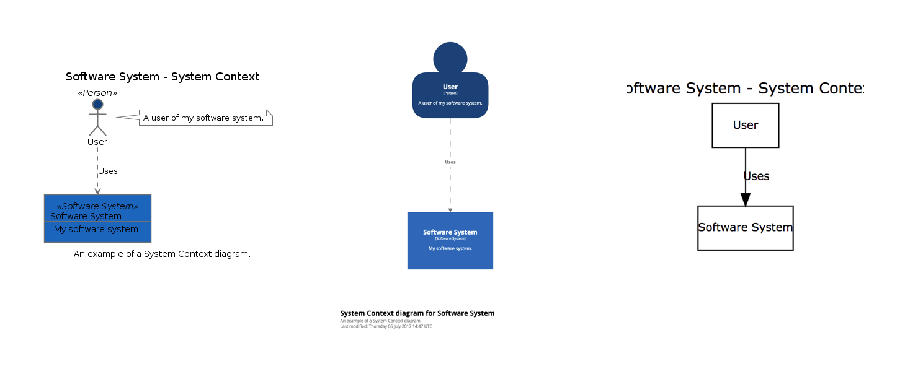

# Structurizr for Java

This GitHub repository is primarily a client library for [Structurizr](https://structurizr.com), a web-based publishing platform for software architecture models based upon the [C4 model](https://c4model.com). It can also be used to create software architecture diagrams that can be rendered with tools such as  [PlantUML](docs/plantuml.md), [Graphviz](docs/graphviz-and-dot.md) and [WebSequenceDiagrams](docs/websequencediagrams.md).

In essence, Structurizr for Java is an implementation of an __executable architecture description language__; a domain-specific language to describe software architecture, using code. The key benefit of using code to create a software architecture model is that you can use the static analysis and reflection features of Java to help you extract components from the codebase you are modelling. Integration of this tooling with your continuous integration/build process helps your software architecture diagrams stay up to date.

## A quick example

As an example, the following Java code can be used to create a software architecture __model__ and an associated __view__ that describes a user using a software system.

```java
public static void main(String[] args) throws Exception {
    Workspace workspace = new Workspace("Getting Started", "This is a model of my software system.");
    Model model = workspace.getModel();
    
    Person user = model.addPerson("User", "A user of my software system.");
    SoftwareSystem softwareSystem = model.addSoftwareSystem("Software System", "My software system.");
    user.uses(softwareSystem, "Uses");
    
    ViewSet views = workspace.getViews();
    SystemContextView contextView = views.createSystemContextView(softwareSystem, "SystemContext", "An example of a System Context diagram.");
    contextView.addAllSoftwareSystems();
    contextView.addAllPeople();
}
```

The view can then be exported to be visualised in a number of different ways; e.g. PlantUML, Structurizr and Graphviz:



## Table of contents

* Introduction
    * [Getting started](docs/getting-started.md)
    * [About Structurizr and how it compares to other tooling](https://structurizr.com/help/about)
    * [Why use code?](https://structurizr.com/help/why-use-code)
    * [Basic concepts](https://structurizr.com/help/concepts) (workspaces, models, views and documentation)
    * [C4 model](https://c4model.com)
    * [Examples](https://structurizr.com/help/examples)
    * [Binaries](docs/binaries.md)
    * [API Client](docs/api-client.md)
    * [Usage patterns](docs/usage-patterns.md)
* Diagrams
    * [System Context diagram](docs/system-context-diagram.md)
    * [Container diagram](docs/container-diagram.md)
    * [Component diagram](docs/component-diagram.md)
    * [Dynamic diagram](docs/dynamic-diagram.md)
    * [Deployment diagram](docs/deployment-diagram.md)
    * [System Landscape diagram](docs/system-landscape-diagram.md)
    * [Styling elements](docs/styling-elements.md)
    * [Styling relationships](docs/styling-relationships.md)
    * [Filtered views](docs/filtered-views.md)
* Documentation
    * [Documentation overview](docs/documentation.md)
    * [Structurizr](docs/documentation-structurizr.md)
    * [arc42](docs/documentation-arc42.md)
    * [Viewpoints and Perspectives](docs/documentation-viewpoints-and-perspectives.md)
    * [Automatic template](docs/documentation-automatic.md)
* Extracting software architecture information from code
    * [Component finder](docs/component-finder.md)
    * [Structurizr annotations](docs/structurizr-annotations.md)
    * [Type matchers](docs/type-matchers.md)
    * [Spring component finder strategies](docs/spring-component-finder-strategies.md)
    * [Supplementing the model from source code](docs/supplementing-from-source-code.md)
    * [Components and supporting types](docs/supporting-types.md)
    * [The Spring PetClinic example](docs/spring-petclinic.md)
* Exporting and visualising with other tools
    * [PlantUML](docs/plantuml.md)
    * [Graphviz and DOT](docs/graphviz-and-dot.md)
    * [WebSequenceDiagrams](docs/websequencediagrams.md)
* Other
    * [Client-side encryption](docs/client-side-encryption.md)
    * [Corporate branding](docs/corporate-branding.md)
    * [Building from source](docs/building.md)
* Related projects
    * [cat-boot-structurizr](https://github.com/Catalysts/cat-boot/tree/master/cat-boot-structurizr): A way to apply dependency management to help modularise Structurizr code.
    * [java-quickstart](https://github.com/structurizr/java-quickstart): A simple starting point for using Structurizr for Java
    * [structurizr-groovy](https://github.com/tidyjava/structurizr-groovy): An initial version of a Groovy wrapper around Structurizr for Java.
    * [structurizr-dotnet](https://github.com/structurizr/dotnet): Structurizr for .NET

[](https://travis-ci.org/structurizr/java)

