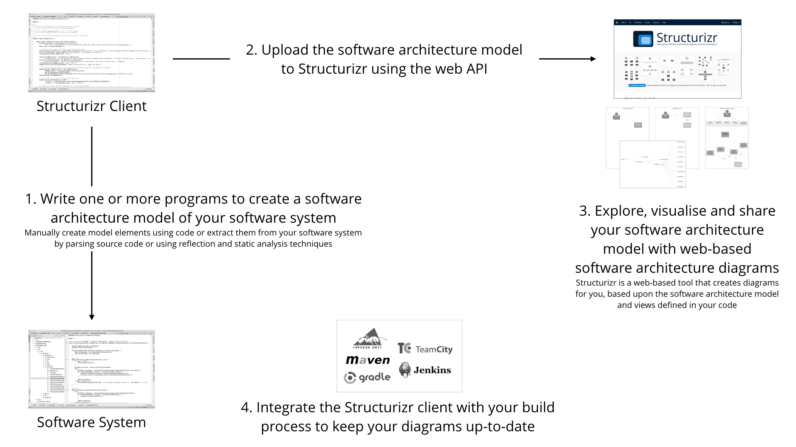

# Structurizr for Java

Structurizr is an implementation of the C4 model as described in Simon Brown's
FREE [The Art of Visualising Software Architecture](https://leanpub.com/visualising-software-architecture) book, which provides a way to easily and effectively communicate the software architecture of a software system. Structurizr allows you to create __software architecture models and diagrams as code__. This GitHub repo provides a Java implementation and tooling to create software architecture models. [structurizr.com](https://structurizr.com) provides a way to create diagrams from those models.



## Table of Contents

1. [Building from source](#building)
1. [Binaries](#binaries)
1. [Getting started](#getting-started)
1. [API Client](docs/api-client.md)
1. [Styling elements](docs/styling-elements.md)
1. [Styling relationships](docs/styling-relationships.md)
1. [Hiding relationships](docs/hiding-relationships.md)
 
## Building

To build "Structurizr for Java" from the sources (you'll need Java 8)...

```
git clone https://github.com/structurizr/java.git
cd java
./gradlew build
```

## Binaries
The Structurizr for Java binaries are hosted on [Bintray](https://bintray.com/structurizr/maven/structurizr-java) and the JCenter repository.
The dependencies for use with Maven, Ivy, Gradle, etc are as follows.

Name                                          | Description
-------------------------------------------   | ---------------------------------------------------------------------------------------------------------------------------
com.structurizr:structurizr-core:0.5.0        | The core library that can used to create models.</td>
com.structurizr:structurizr-client:0.5.0      | The structurizr.com API client for Java for uploading models.
com.structurizr:structurizr-spring:0.5.0      | The Spring integration to extract classes annotated @Controller, @Service and @Repository for identification as components.
com.structurizr:structurizr-annotations:0.5.0 | Annotations to add software architecture hints into your own code.

## Getting started

Here is a quick overview of how to get started with Structurizr for Java so that you can create a software architecture model as code. You can find the code [here](https://github.com/structurizr/java/blob/master/structurizr-examples/src/com/structurizr/example/core/GettingStarted.java). For more examples, please see [structurizr-examples](https://github.com/structurizr/java/tree/master/structurizr-examples/src/com/structurizr/example).

> If you want a quick start, simply clone the [Structurizr for Java starter project](https://github.com/structurizr/java-starter).

### 1. Dependencies

The Structurizr for Java binaries are hosted on [Bintray](https://bintray.com/structurizr/maven/structurizr-java) and the JCenter repository.
The dependencies for use with Maven, Ivy, Gradle, etc are as follows.

Name                                          | Description
-------------------------------------------   | ---------------------------------------------------------------------------------------------------------------------------
com.structurizr:structurizr-core:0.5.0        | The core library that can used to create models.</td>
com.structurizr:structurizr-client:0.5.0      | The structurizr.com API client for Java for uploading models.

### 2. Create a model

The first step is to create a workspace in which the software architecture model will reside.

```java
Workspace workspace = new Workspace("My model", "This is a model of my software system.");
Model model = workspace.getModel();
```

Now let's add some elements to the model.

```java
Person user = model.addPerson("User", "A user of my software system.");
SoftwareSystem softwareSystem = model.addSoftwareSystem("Software System", "My software system.");
user.uses(softwareSystem, "Uses");
```

### 3. Create some views

With the model created, we need to create some views with which to visualise it.

```java
ViewSet viewSet = workspace.getViews();
SystemContextView contextView = viewSet.createContextView(softwareSystem);
contextView.addAllSoftwareSystems();
contextView.addAllPeople();
```

### 4. Add some colour

Elements and relationships can be styled by specifying colours, sizes and shapes.

```java
Styles styles = viewSet.getConfiguration().getStyles();
styles.addElementStyle(Tags.SOFTWARE_SYSTEM).background("#A4B7C9").color("#000000");
styles.addElementStyle(Tags.PERSON).background("#728da5").color("#ffffff");
```

### 5. Upload to Structurizr</h2>

structurizr.com provides an API to get and put workspaces directly from/to your Structurizr account as follows.

```java
StructurizrClient structurizrClient = new StructurizrClient("key", "secret");
structurizrClient.putWorkspace(1234, workspace);
```

> In order to upload your model to Structurizr using the web API, you'll need to [sign up](https://structurizr.com/signup) to get your own API key and secret.

The result is a diagram like this (once you've dragged the boxes around).


#### Retaining diagram layout information

Once you have uploaded your model to Structurizr and organised the boxes on the diagrams, you'll probably want to retain the diagram layout next time you upload the model. To do this, you can use the `mergeWorkspace` helper method on the `StructurizrClient`.

```java
structurizrClient.mergeWorkspace(1234, workspace);
```

This will get the current version of the workspace via the API, merge the diagram layout information, and then upload the new version via the API. See [API Client](docs/api-client.md) for more details.