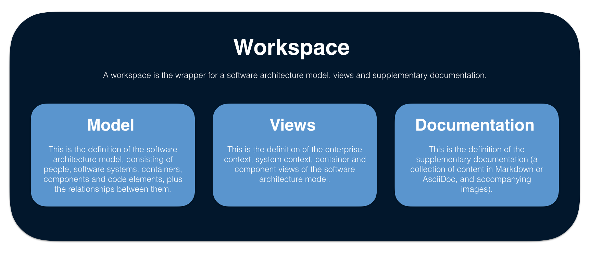

# Basic concepts

In Structurizr, a __workspace__ is the wrapper for your software architecture __model__, __views__ and __documentation__. The recommendation is that a workspace contains the model, views and documentation for a __single software system__.

## Model

This is the definition of the software architecture model, consisting of people, software systems, containers, components and code elements, plus the relationships between them. The model can be created by manually specifying model elements, or using static analysis and reflection techniques.

## Views

This is the definition of the enterprise context, system context, container and component views of the software architecture model. Each view is rendered by [Structurizr](structurizr.com) as a diagram, with the client library providing control over which elements are included in the resulting diagram. Styling information (colours, shapes, font sizes, etc) is also included here.

## Documentation

This is the definition of the supplementary documentation; a collection of content in Markdown or AsciiDoc, and accompanying images. Documentation consists of a number of different possible sections, each of which takes the form of a separate piece of Markdown or AsciiDoc content. Structurizr diagrams can be embedded into the documentation sections too.