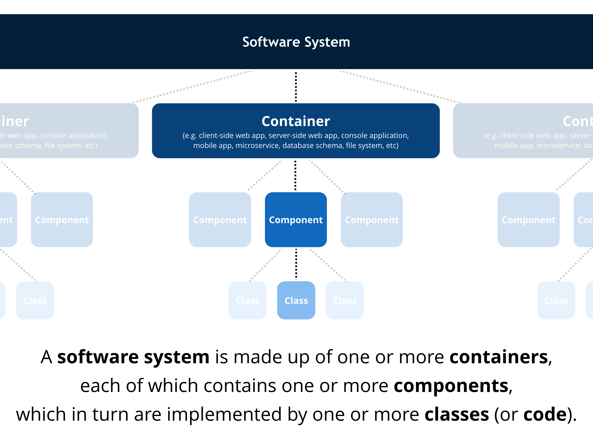

# C4 model

The "C4 model" is a simple hierarchical way to think about the static structures of a software system in terms of containers, components and classes (or code).

> A software system is made up of one or more containers (web applications, mobile apps, desktop applications, databases, file systems, etc), each of which contains one or more components, which in turn are implemented by one or more classes.

Visualising this hierarchy is then done by creating a collection of [System Context](system-context-diagram.md), [Container](container-diagram.md), [Component](component-diagram.md) and (optionally) Class diagrams.

## More information

For more information, please see [Software Architecture for Developers - Volume 2](https://leanpub.com/visualising-software-architecture) (Leanpub) or one of the many conference talks about the topic (e.g. [The Art of Visualising Software Architecture](https://www.youtube.com/watch?v=aPtT2GNu8vM&feature=youtu.be&t=9m04s) from Voxxed Days Athens 2017). Here's a 1-page "cheat sheet" too.

