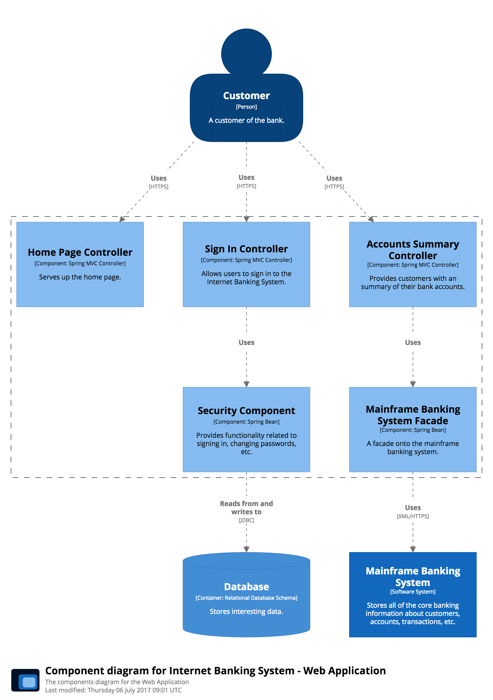

# Component diagram

Following on from a Container Diagram, next you can zoom in and decompose each container further to identify the major structural building blocks and their interactions.

The Component diagram shows how a container is made up of a number of "components", what each of those components are, their responsibilities and the technology/implementation details.

## Example

This is an example Component diagram for a fictional Internet Banking System, showing some (rather than all) of the components within the API Application. Here, there are two Spring MVC Rest Controllers providing access points for the JSON/HTTPS API, with each controller subsequently using other components to access data from the Database and Mainframe Banking System.

See [BigBankPlc.java](https://github.com/structurizr/java/blob/master/structurizr-examples/src/com/structurizr/example/BigBankPlc.java) for the code, and [https://structurizr.com/share/36141#Components](https://structurizr.com/share/36141#Components) for the diagram.

### Extracting components automatically

Please note that, in a real-world scenario, you would probably want to extract components automatically from a codebase with the [component finder](component-finder.md), using static analysis and reflection techniques. 