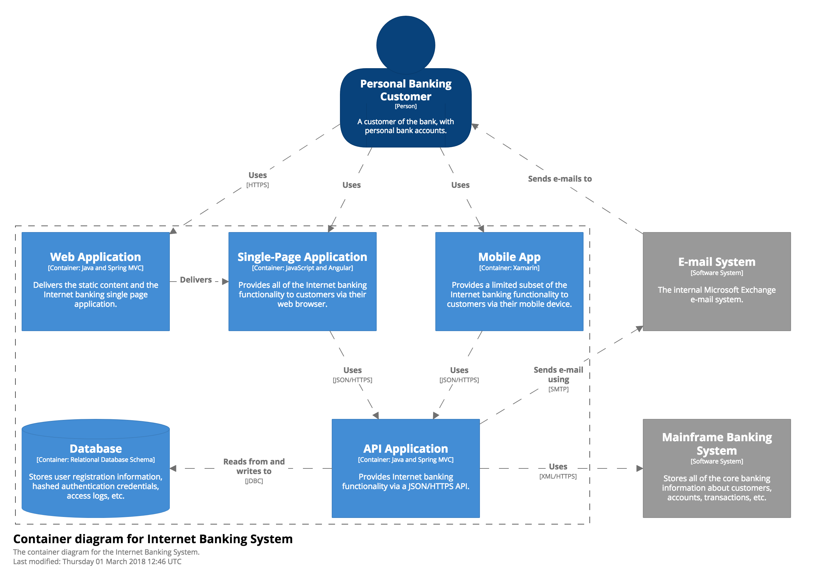

# Container diagram

Once you understand how your system fits in to the overall IT environment, a really useful next step is to illustrate the high-level technology choices with a Container diagram. A "container" is something like a web application, desktop application, mobile app, database, file system, etc. Essentially, a container is a separately deployable unit that executes code or stores data.

The Container diagram shows the high-level shape of the software architecture and how responsibilities are distributed across it. It also shows the major technology choices and how the containers communicate with one another. It's a simple, high-level technology focussed diagram that is useful for software developers and support/operations staff alike.

## Example

As an example, a Container diagram for a simplified, fictional Internet Banking System might look something like this. In summary, it shows that the Internet Banking System is made up a Web Application and a Database. It also shows the relationship between the Web Application and the Mainframe Banking System.



With Structurizr for Java, you can create this diagram with code like the following:

```java
Container webApplication = internetBankingSystem.addContainer("Web Application", "Provides all of the Internet banking functionality to customers.", "Java and Spring MVC");
Container database = internetBankingSystem.addContainer("Database", "Stores interesting data.", "Relational Database Schema");

customer.uses(webApplication, "HTTPS");
webApplication.uses(database, "Reads from and writes to", "JDBC");
webApplication.uses(mainframeBankingSystem, "Uses", "XML/HTTPS");

ContainerView containerView = views.createContainerView(internetBankingSystem, "Containers", "The container diagram for the Internet Banking System.");
containerView.add(customer);
containerView.addAllContainers();
containerView.add(mainframeBankingSystem);
```

See [BigBankPlc.java](https://github.com/structurizr/java/blob/master/structurizr-examples/src/com/structurizr/example/BigBankPlc.java) for the full code, and [https://structurizr.com/share/36141#Containers](https://structurizr.com/share/36141#Containers) for the diagram.