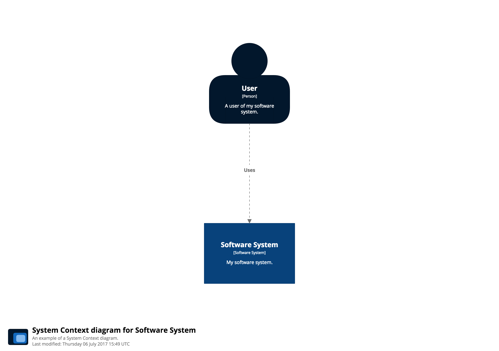

# Corporate branding

> Note: this page describes a feature that is not available to use with Structurizr's Free Plan.

In addition to [styling diagram elements](styling-elements.md) and [relationships](styling-relationships.md), some corporate branding can be added to diagrams and documentation. This includes:

- A font (font name and optional web font URL).
- A logo (a URL to an image file or a data URI).
- 5 foreground/background colour pairs.

Here's an example diagram that hasn't been styled, aside from setting the shape of the ```Person``` elements.


And here's what the documentation looks like.


You can add branding to an existing workspace, as follows:

```java
Branding branding = views.getConfiguration().getBranding();
branding.setColor1(new ColorPair("#02172C", "#ffffff"));
branding.setColor2(new ColorPair("#08427B", "#ffffff"));
branding.setColor3(new ColorPair("#1168BD", "#ffffff"));
branding.setColor4(new ColorPair("#438DD5", "#ffffff"));
branding.setColor5(new ColorPair("#85BBF0", "#ffffff"));
branding.setLogo(ImageUtils.getImageAsDataUri(new File("./docs/images/structurizr-logo.png")));
```

## Diagrams

If no colours have been specified via diagram element styles, colour pairs 1-4 will be used when rendering people, software systems, containers and components respectively.  Here's the same diagram, now with added branding. Notice that the logo is now also shown in the bottom left corner.



## Documentation

With documentation, the colour pairs are mapped onto the navigation links at the top of the page, while the first colour pair is used when rendering hyperlinks. Again, the logo is shown.


See [CorporateBranding.java](https://github.com/structurizr/java/blob/master/structurizr-examples/src/com/structurizr/example/CorporateBranding.java) for a full example, and [https://structurizr.com/share/35031](https://structurizr.com/share/35031) to access the workspace.
