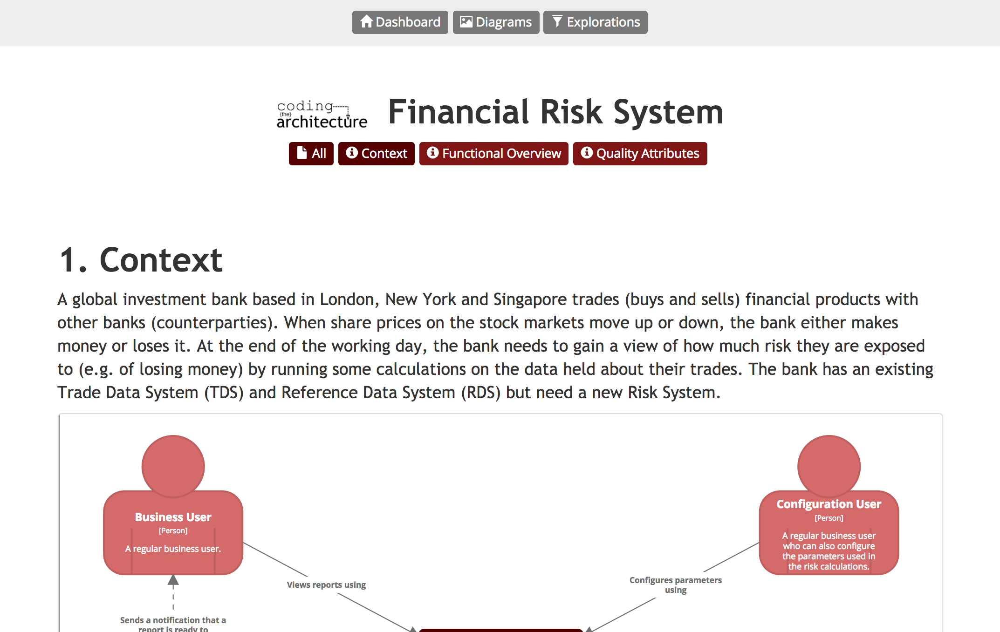
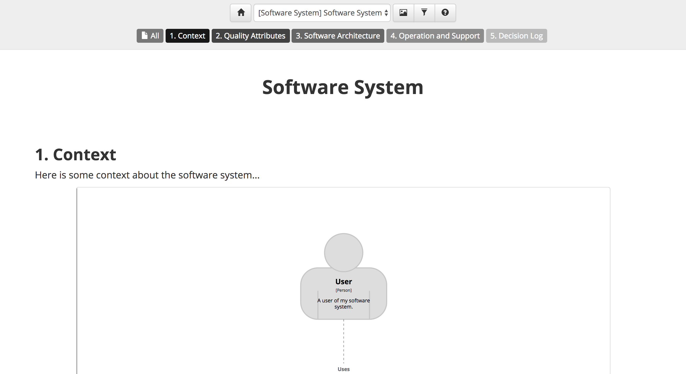

# Corporate branding

In addition to styling diagram elements and relationships, some corporate branding can be added to the Structurizr hosted diagrams and documentation. This includes:

- A font (font name and optional web font URL)
- A logo (a URL to an image file or a data URI)
- 5 foreground/background colour pairs.

See [Corporate branding](https://structurizr.com/help/corporate-branding) for more details.





Here is an example of how to add branding to an existing workspace.

```java
Branding branding = viewSet.getConfiguration().getBranding();
branding.setFont(new Font("Trebuchet MS"));
branding.setColor1(new ColorPair("#550000", "#ffffff"));
branding.setColor2(new ColorPair("#801515", "#ffffff"));
branding.setColor3(new ColorPair("#d46a6a", "#ffffff"));
branding.setColor4(new ColorPair("#d46a6a", "#ffffff"));
branding.setColor5(new ColorPair("#d46a6a", "#ffffff"));
branding.setLogo(ImageUtils.getImageAsDataUri(new File("codingthearchitecture.png")));
```