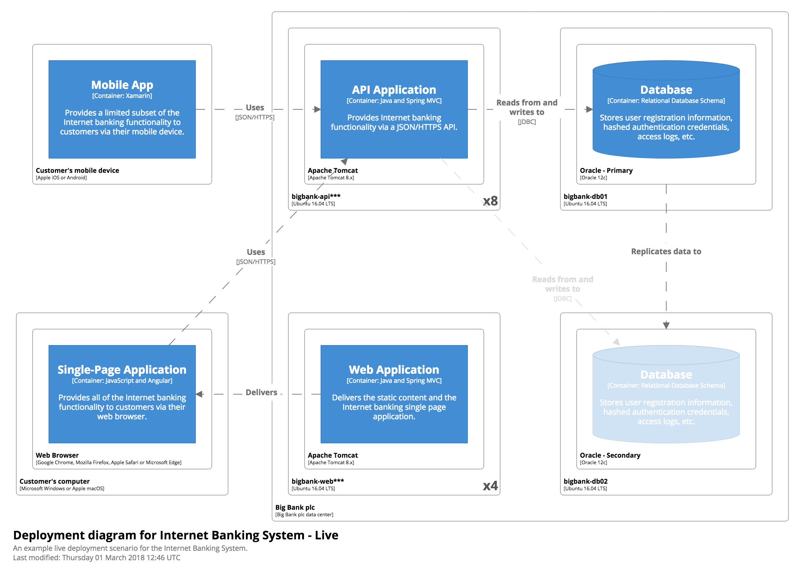

# Deployment diagram

A Deployment diagram allows you to illustrate how containers in the static model are mapped to infrastructure at deployment time. It's based upon the [UML deployment diagram](https://en.wikipedia.org/wiki/Deployment_diagram).

## Example

As an example, a Deployment diagram for the live environment of a simplified, fictional Internet Banking System might look something like this. In summary, it shows the deployment of the Web Application and the Database, with a secondary Database being used for failover purposes.



With Structurizr for Java, you can create this diagram with code like the following:

```java
DeploymentNode liveWebServer = model.addDeploymentNode("bigbank-web***", "A web server residing in the web server farm, accessed via F5 BIG-IP LTMs.", "Ubuntu 16.04 LTS", 8, MapUtils.create("Location=London"));
liveWebServer.addDeploymentNode("Apache Tomcat", "An open source Java EE web server.", "Apache Tomcat 8.x", 1, MapUtils.create("Xmx=512M", "Xms=1024M", "Java Version=8"))
    .add(webApplication);

DeploymentNode primaryDatabaseServer = model.addDeploymentNode("bigbank-db01", "The primary database server.", "Ubuntu 16.04 LTS", 1, MapUtils.create("Location=London"))
    .addDeploymentNode("Oracle - Primary", "The primary, live database server.", "Oracle 12c");
primaryDatabaseServer.add(database);

DeploymentNode secondaryDatabaseServer = model.addDeploymentNode("bigbank-db02", "The secondary database server.", "Ubuntu 16.04 LTS", 1, MapUtils.create("Location=Reading"))
    .addDeploymentNode("Oracle - Secondary", "A secondary, standby database server, used for failover purposes only.", "Oracle 12c");
ContainerInstance secondaryDatabase = secondaryDatabaseServer.add(database);

model.getRelationships().stream().filter(r -> r.getDestination().equals(secondaryDatabase)).forEach(r -> r.addTags("Failover"));
Relationship dataReplicationRelationship = primaryDatabaseServer.uses(secondaryDatabaseServer, "Replicates data to", "");
secondaryDatabase.addTags("Failover");

DeploymentView liveDeploymentView = views.createDeploymentView(internetBankingSystem, "LiveDeployment", "An example live deployment scenario for the Internet Banking System.");
liveDeploymentView.add(liveWebServer);
liveDeploymentView.add(primaryDatabaseServer);
liveDeploymentView.add(secondaryDatabaseServer);
liveDeploymentView.add(dataReplicationRelationship);
```

See [BigBankPlc.java](https://github.com/structurizr/java/blob/master/structurizr-examples/src/com/structurizr/example/core/BigBankPlc.java) for the full code, and [https://structurizr.com/share/36141#LiveDeployment](https://structurizr.com/share/36141#LiveDeployment) for the diagram.