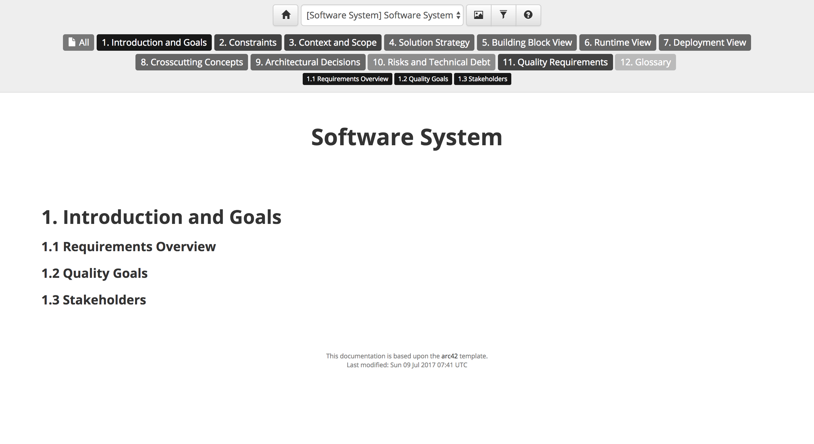

# arc42 documentation template

Structurizr for Java includes an implementation of the [arc42 documentation template](http://arc42.org), which can be used to document your software architecture.

## Example

To use this template, create an instance of the [Arc42Documentation](https://github.com/structurizr/java/blob/master/structurizr-core/src/com/structurizr/documentation/Arc42Documentation.java) class.
You can then add documentation sections as needed, each associated with a software system in your software architecture model, using Markdown or AsciiDoc. For example:

```java
Arc42Documentation documentation = new Arc42Documentation(workspace);

File documentationRoot = new File("./structurizr-examples/src/com/structurizr/example/documentation/arc42/markdown");
documentation.addIntroductionAndGoalsSection(softwareSystem, Format.Markdown, new File(documentationRoot, "01-introduction-and-goals.md"));
documentation.addConstraintsSection(softwareSystem, Format.Markdown, new File(documentationRoot, "02-architecture-constraints.md"));
documentation.addContextAndScopeSection(softwareSystem, Format.Markdown, new File(documentationRoot, "03-system-scope-and-context.md"));
documentation.addSolutionStrategySection(softwareSystem, Format.Markdown, new File(documentationRoot, "04-solution-strategy.md"));
documentation.addBuildingBlockViewSection(softwareSystem, Format.Markdown, new File(documentationRoot, "05-building-block-view.md"));
documentation.addRuntimeViewSection(softwareSystem, Format.Markdown, new File(documentationRoot, "06-runtime-view.md"));
documentation.addDeploymentViewSection(softwareSystem, Format.Markdown, new File(documentationRoot, "07-deployment-view.md"));
documentation.addCrosscuttingConceptsSection(softwareSystem, Format.Markdown, new File(documentationRoot, "08-crosscutting-concepts.md"));
documentation.addArchitecturalDecisionsSection(softwareSystem, Format.Markdown, new File(documentationRoot, "09-architecture-decisions.md"));
documentation.addRisksAndTechnicalDebtSection(softwareSystem, Format.Markdown, new File(documentationRoot, "10-quality-requirements.md"));
documentation.addQualityRequirementsSection(softwareSystem, Format.Markdown, new File(documentationRoot, "11-risks-and-technical-debt.md"));
documentation.addGlossarySection(softwareSystem, Format.Markdown, new File(documentationRoot, "12-glossary.md"));
```

Structurizr will create navigation controls based upon the the sections in the documentation, and the software systems they have been associated with. This particular example is rendered as follows: 



See [Arc42DocumentationExample.java](https://github.com/structurizr/java/blob/master/structurizr-examples/src/com/structurizr/example/Arc42DocumentationExample.java) for the full code, and [https://structurizr.com/share/27791/documentation](https://structurizr.com/share/27791/documentation) to see the rendered documentation.

## More information

See [Help - Documentation](https://structurizr.com/help/documentation) for more information about how headings are rendered, and how to embed diagrams from you workspace into the documentation.