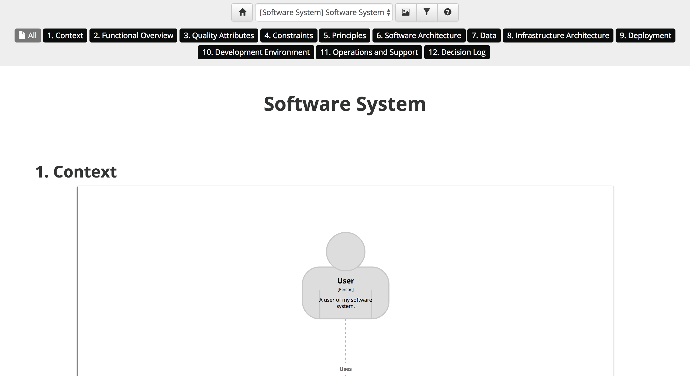

# Automatic documentation template

Structurizr for Java includes an automatic documentation template, which will scan a given directory and automatically add all Markdown or AsciiDoc
files in that directory. Each file must represent a separate section, and the second level heading ("## Section Title" in Markdown and "== Section Title" in AsciiDoc) will be used as the section name.

## Example

To use this template, create an instance of the [AutomaticDocumentationTemplate](https://github.com/structurizr/java/blob/master/structurizr-core/src/com/structurizr/documentation/AutomaticDocumentationTemplate.java) class.
You can then add documentation sections as needed, each associated with a software system in your software architecture model, using Markdown or AsciiDoc. For example:

```java
File documentationRoot = new File("./structurizr-examples/src/com/structurizr/example/documentation/automatic");

AutomaticDocumentationTemplate template = new AutomaticDocumentationTemplate(workspace);
template.addSections(softwareSystem, documentationRoot);
```

Structurizr will create navigation controls based upon the the sections in the documentation, and the software systems they have been associated with. This particular example is rendered as follows: 



See [AutomaticDocumentationTemplateExample.java](https://github.com/structurizr/java/blob/master/structurizr-examples/src/com/structurizr/example/AutomaticDocumentationTemplateExample.java.java) for the full code, and [https://structurizr.com/share/35971/documentation](https://structurizr.com/share/35971/documentation) to see the rendered documentation.

## More information

See [Help - Documentation](https://structurizr.com/help/documentation) for more information about how headings are rendered, and how to embed diagrams from you workspace into the documentation.