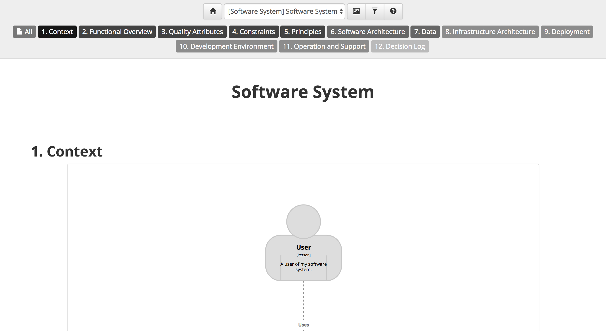

# Structurizr documentation template

Structurizr for Java includes an implementation of the "software guidebook" from Simon Brown's [Software Architecture for Developers](https://leanpub.com/visualising-software-architecture) book, which can be used to document your software architecture.

## Example

To use this template, create an instance of the [StructurizrDocumentationTemplate](https://github.com/structurizr/java/blob/master/structurizr-core/src/com/structurizr/documentation/StructurizrDocumentationTemplate.java) class.
You can then add documentation sections as needed, each associated with a software system in your software architecture model, using Markdown or AsciiDoc. For example:

```java
StructurizrDocumentationTemplate template = new StructurizrDocumentationTemplate(workspace);

File documentationRoot = new File("./structurizr-examples/src/com/structurizr/example/documentation/structurizr/markdown");
template.addContextSection(softwareSystem, Format.Markdown, new File(documentationRoot, "01-context.md"));
template.addFunctionalOverviewSection(softwareSystem, Format.Markdown, new File(documentationRoot, "02-functional-overview.md"));
template.addQualityAttributesSection(softwareSystem, Format.Markdown, new File(documentationRoot, "03-quality-attributes.md"));
template.addConstraintsSection(softwareSystem, Format.Markdown, new File(documentationRoot, "04-constraints.md"));
template.addPrinciplesSection(softwareSystem, Format.Markdown, new File(documentationRoot, "05-principles.md"));
template.addSoftwareArchitectureSection(softwareSystem, Format.Markdown, new File(documentationRoot, "06-software-architecture.md"));
template.addDataSection(softwareSystem, Format.Markdown, new File(documentationRoot, "07-data.md"));
template.addInfrastructureArchitectureSection(softwareSystem, Format.Markdown, new File(documentationRoot, "08-infrastructure-architecture.md"));
template.addDeploymentSection(softwareSystem, Format.Markdown, new File(documentationRoot, "09-deployment.md"));
template.addDevelopmentEnvironmentSection(softwareSystem, Format.Markdown, new File(documentationRoot, "10-development-environment.md"));
template.addOperationAndSupportSection(softwareSystem, Format.Markdown, new File(documentationRoot, "11-operation-and-support.md"));
template.addDecisionLogSection(softwareSystem, Format.Markdown, new File(documentationRoot, "12-decision-log.md"));
```

Structurizr will create navigation controls based upon the the sections in the documentation, and the software systems they have been associated with. This particular example is rendered as follows: 



See [StructurizrDocumentationExample.java](https://github.com/structurizr/java/blob/master/structurizr-examples/src/com/structurizr/example/StructurizrDocumentationExample.java) for the full code, and [https://structurizr.com/share/14181/documentation](https://structurizr.com/share/14181/documentation) to see the rendered documentation.

## More information

See [Help - Documentation](https://structurizr.com/help/documentation) for more information about how headings are rendered, and how to embed diagrams from you workspace into the documentation.