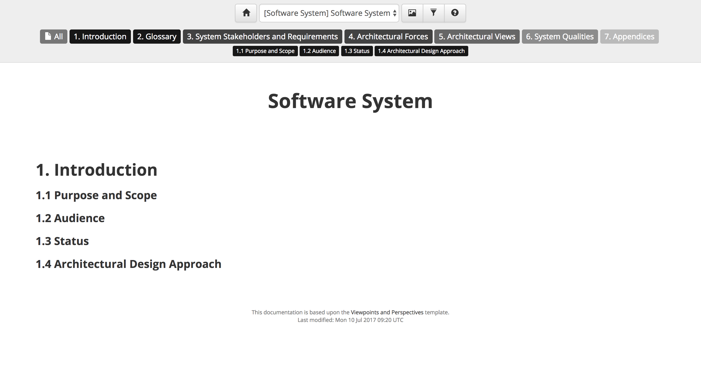

# Viewpoints and Perspectives documentation template

Structurizr for Java includes an implementation of the [Viewpoints and Perspectives documentation template](http://www.viewpoints-and-perspectives.info), which can be used to document your software architecture.

## Example

To use this template, create an instance of the [ViewpointsAndPerspectivesDocumentationTemplate](https://github.com/structurizr/java/blob/master/structurizr-core/src/com/structurizr/documentation/ViewpointsAndPerspectivesDocumentationTemplate.java) class.
You can then add documentation sections as needed, each associated with a software system in your software architecture model, using Markdown or AsciiDoc. For example:

```java
ViewpointsAndPerspectivesDocumentationTemplate template = new ViewpointsAndPerspectivesDocumentationTemplate(workspace);

File documentationRoot = new File("./structurizr-examples/src/com/structurizr/example/documentation/viewpointsandperspectives/markdown");
template.addIntroductionSection(softwareSystem, Format.Markdown, new File(documentationRoot, "01-introduction.md"));
template.addGlossarySection(softwareSystem, Format.Markdown, new File(documentationRoot, "02-glossary.md"));
template.addSystemStakeholdersAndRequirementsSection(softwareSystem, Format.Markdown, new File(documentationRoot, "03-system-stakeholders-and-requirements.md"));
template.addArchitecturalForcesSection(softwareSystem, Format.Markdown, new File(documentationRoot, "04-architectural-forces.md"));
template.addArchitecturalViewsSection(softwareSystem, Format.Markdown, new File(documentationRoot, "05-architectural-views"));
template.addSystemQualitiesSection(softwareSystem, Format.Markdown, new File(documentationRoot, "06-system-qualities.md"));
template.addAppendicesSection(softwareSystem, Format.Markdown, new File(documentationRoot, "07-appendices.md"));
```

Structurizr will create navigation controls based upon the the sections in the documentation, and the software systems they have been associated with. This particular example is rendered as follows: 



See [ViewpointsAndPerspectivesDocumentationExample.java](https://github.com/structurizr/java/blob/master/structurizr-examples/src/com/structurizr/example/ViewpointsAndPerspectivesDocumentationExample.java) for the full code, and [https://structurizr.com/share/36371/documentation](https://structurizr.com/share/36371/documentation) to see the rendered documentation.

## More information

See [Help - Documentation](https://structurizr.com/help/documentation) for more information about how headings are rendered, and how to embed diagrams from you workspace into the documentation.