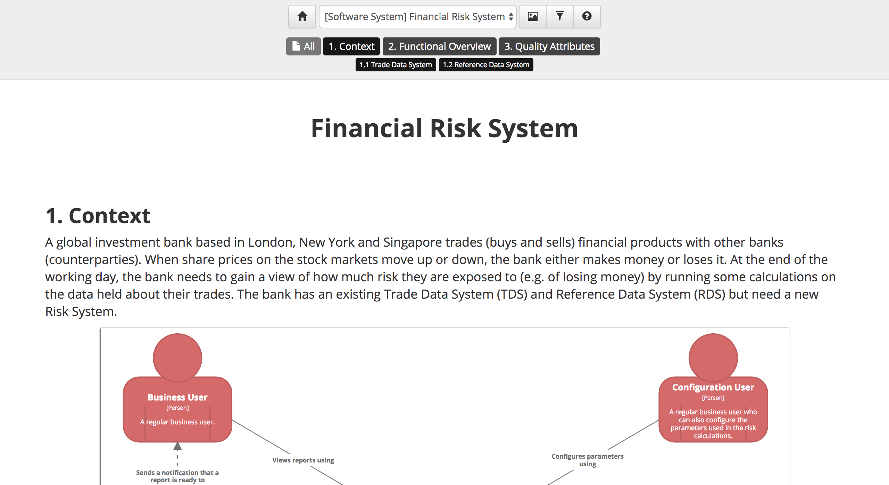
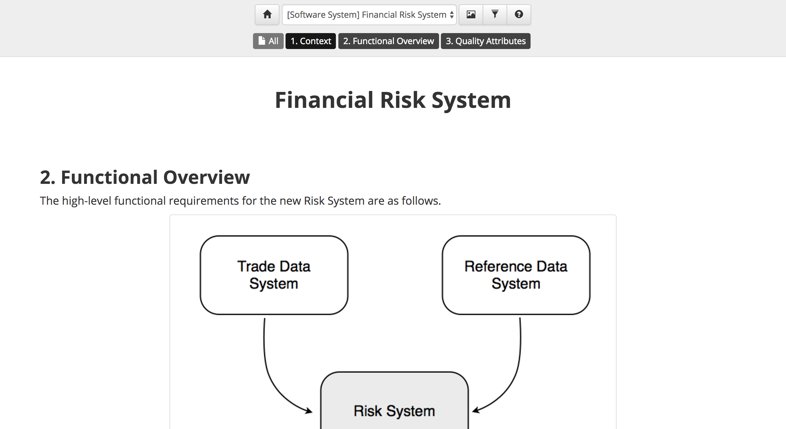
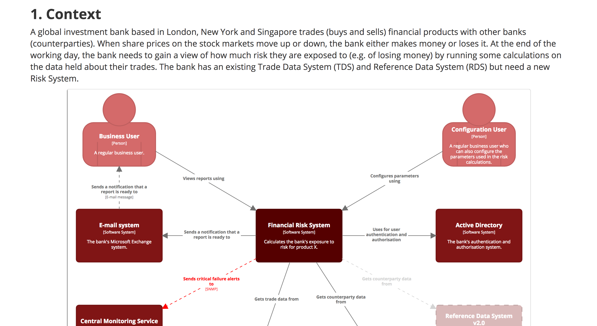

# Documentation

In addition to diagrams, Structurizr lets you create supplementary documentation using the Markdown or AsciiDoc formats.



See [https://structurizr.com/share/31/documentation](https://structurizr.com/share/31/documentation) for an example.

## Documentation templates

The documentation is broken up into a number of sections, as defined by the template you are using, the following of which are included:

- [Structurizr](documentation-structurizr.md)
- [arc42](documentation-arc42.md)

## Custom sections

You can add custom sections using the ```addCustomSection``` method on the [Documentation](https://github.com/structurizr/java/blob/master/structurizr-core/src/com/structurizr/documentation/Documentation.java) class, by specifying the section name (a String) and group (an integer, 1-5; this is used for colour coding section navigation buttons):

```java
documentation.addCustomSection(softwareSystem, "My custom section", 3, Format.Markdown, ...);
```

## Images

Images can be included using the regular Markdown/AsciiDoc syntax.



For this to work, the image files must be hosted externally (e.g. on your own web server, ideally accessible via HTTPS) or uploaded with your workspace using the ```addImages()``` or ```addImage()``` methods on the [Documentation class](https://github.com/structurizr/java/blob/master/structurizr-core/src/com/structurizr/documentation/Documentation.java).

```java
documentation.addImages(new File("..."));
```

See [functional-overview.md](https://raw.githubusercontent.com/structurizr/java/master/structurizr-examples/src/com/structurizr/example/financialrisksystem/functional-overview.md) and [FinancialRiskSystem](https://github.com/structurizr/java/blob/master/structurizr-examples/src/com/structurizr/example/FinancialRiskSystem.java) for an example.

## Embedding diagrams

Software architecture diagrams from your workspace can be embedded within the documentation sections using an additional special syntax.



The syntax is similar to that used for including images, for example:

```
Markdown - 
AsciiDoc - image::embed:DiagramKey[]
```

See [context.md](https://raw.githubusercontent.com/structurizr/java/master/structurizr-examples/src/com/structurizr/example/financialrisksystem/context.md), [context.adoc](https://raw.githubusercontent.com/structurizr/java/master/structurizr-examples/src/com/structurizr/example/financialrisksystem/context.adoc) and [FinancialRiskSystem](https://github.com/structurizr/java/blob/master/structurizr-examples/src/com/structurizr/example/FinancialRiskSystem.java) for an example.