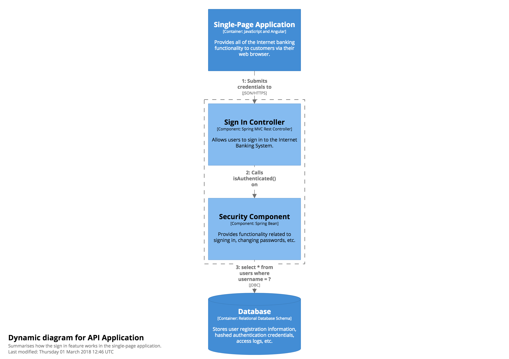

# Dynamic diagram

A simple dynamic diagram can be useful when you want to show how elements in a static model collaborate at runtime to implement a user story, use case, feature, etc. This dynamic diagram is based upon a [UML communication diagram](https://en.wikipedia.org/wiki/Communication_diagram) (previously known as a "UML collaboration diagram"). It is similar to a [UML sequence diagram](https://en.wikipedia.org/wiki/Sequence_diagram) although it allows a free-form arrangement of diagram elements with numbered interactions to indicate ordering.

## Example

As an example, a Dynamic diagram describing the customer sign in process for a simplified, fictional Internet Banking System might look something like this. In summary, it shows the components involved in the sign in process, and the interactions between them.



See [InternetBankingSystem.java](https://github.com/structurizr/examples/blob/main/java/src/main/java/com/structurizr/example/bigbankplc/InternetBankingSystem.java) for the code, and [https://structurizr.com/share/36141/diagrams#SignIn](https://structurizr.com/share/36141/diagrams#SignIn) for the diagram.

### Adding relationships

In order to add a relationship between two elements to a dynamic view, that relationship must already exist between the two elements in the static view.

### Parallel behaviour

Showing parallel behaviour is also possible using the ```startParallelSequence()``` and ```endParallelSequence()``` methods on the ```DynamicView``` class. See [MicroservicesExample.java](https://github.com/structurizr/java/blob/master/structurizr-examples/src/com/structurizr/example/MicroservicesExample.java) and [https://structurizr.com/share/4241#CustomerUpdateEvent](https://structurizr.com/share/4241#CustomerUpdateEvent) for an example.