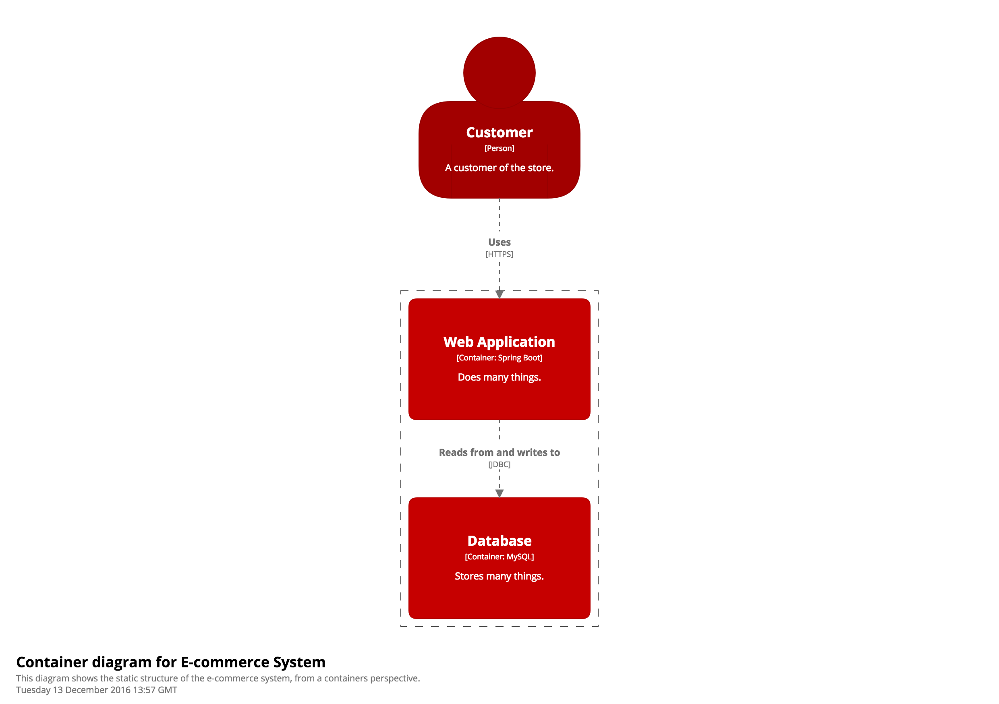
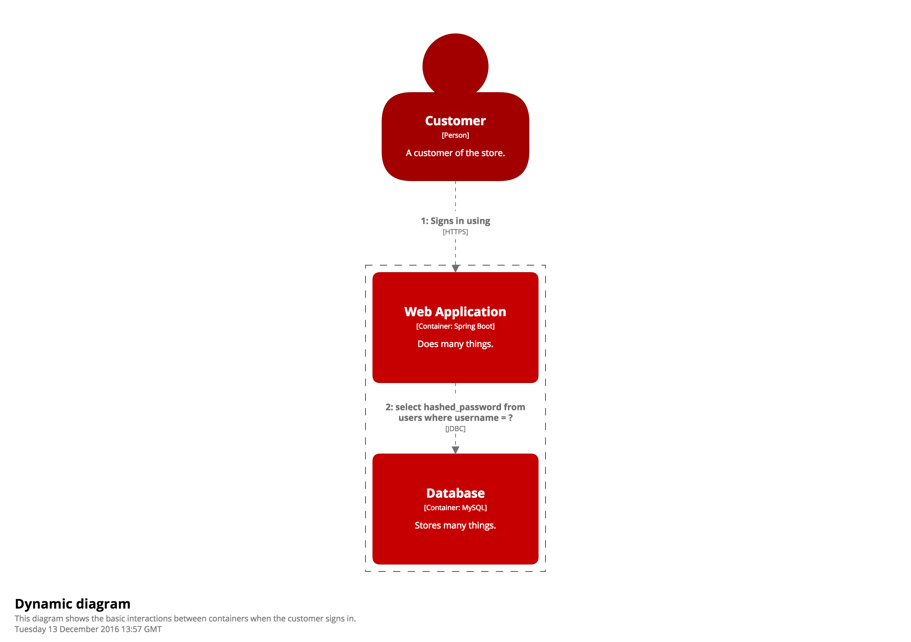
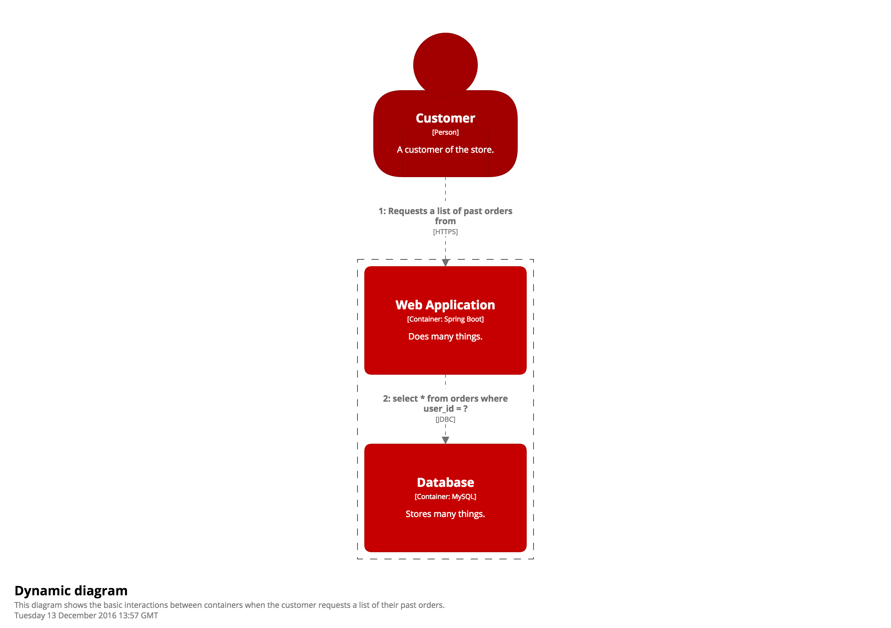

# Dynamic views

In addition to the static views (enterprise context, system context, containers and components), Structurizr provides support for a simple dynamic view. This can be useful when you want to show how elements in a static model collaborate at runtime to implement a user story, use case, feature, etc.

The dynamic diagram in Structurizr is based upon a [UML communication diagram](https://en.wikipedia.org/wiki/Communication_diagram) (previously known as a "UML collaboration diagram"). This is similar to a [UML sequence diagram](https://en.wikipedia.org/wiki/Sequence_diagram) although it allows a free-form arrangement of diagram elements with numbered interactions to indicate ordering.

__Please note that dynamic views are not available in the Free Plan.__

## An example

Let's imagine that you've created a container diagram to describe the software architecture of an e-commerce system as follows.

```java
Person customer = model.addPerson("Customer", "A customer of the store.");
SoftwareSystem softwareSystem = model.addSoftwareSystem("E-commerce System", "Allows customers to buy things online.");
Container webApplication = softwareSystem.addContainer("Web Application", "Does many things.", "Spring Boot");
Container database = softwareSystem.addContainer("Database", "Stores many things.", "MySQL");

customer.uses(webApplication, "Uses", "HTTPS");
webApplication.uses(database, "Reads from and writes to", "JDBC");

ContainerView containerView = views.createContainerView(softwareSystem, "containers", "This diagram shows the static structure of the e-commerce system, from a containers perspective.");
containerView.addAllElements();
```



To create a dynamic view, simply create a ```DynamicView``` object and add the relationships to it that you want to show. For example, the interactions between containers during the sign in process could be described as follows.

```java
DynamicView dynamicView1 = views.createDynamicView(softwareSystem, "signin", "This diagram shows the basic interactions between containers when the customer signs in.");
dynamicView1.add(customer, "Signs in using", webApplication);
dynamicView1.add(webApplication, "select hashed_password from users where username = ?", database);
```

This code snippet adds two relationships to the dynamic view, which are numbered according to the order in which they are added, and the relationship description has been overridden.



Similarly, we can create another dynamic view showing what happens when the customer requests a list of their past orders.

```java
DynamicView dynamicView2 = views.createDynamicView(softwareSystem, "showPastOrders", "This diagram shows the basic interactions between containers when the customer requests a list of their past orders.");
dynamicView2.add(customer, "Requests a list of past orders from", webApplication);
dynamicView2.add(webApplication, "select * from orders where user_id = ?", database);
```



## Adding relationships

In order to add a relationship between two elements to a dynamic view, that relationship must already exist between the two elements in the static view.

## Parallel behaviour

Showing parallel behaviour is also possible using the ```startParallelSequence()``` and ```endParallelSequence()``` methods on the ```DynamicView``` class. See [MicroservicesExample.java](https://github.com/structurizr/java/blob/master/structurizr-examples/src/com/structurizr/example/core/MicroservicesExample.java) and the [live diagrams](https://structurizr.com/public/4241#CustomerUpdateEvent) for an example.