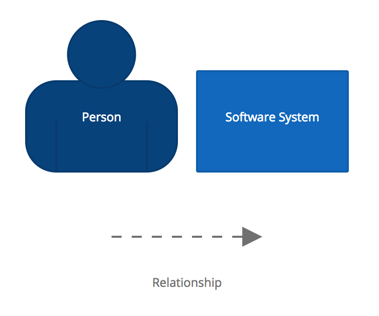

# Getting started

Here is a quick overview of how to get started with Structurizr for Java so that you can create a software architecture model as code. You can find the code at [GettingStarted.java](https://github.com/structurizr/java/blob/master/structurizr-examples/src/com/structurizr/example/core/GettingStarted.java) and the live example workspace at [https://structurizr.com/share/25441](https://structurizr.com/share/25441).

For more examples, please see [structurizr-examples](https://github.com/structurizr/java/tree/master/structurizr-examples/src/com/structurizr/example).

## 1. Dependencies

The Structurizr for Java binaries are hosted on [Bintray](https://bintray.com/structurizr/maven/structurizr-java) and the JCenter repository.
The dependencies for use with Maven, Ivy, Gradle, etc are as follows.

Name                                          | Description
-------------------------------------------   | ---------------------------------------------------------------------------------------------------------------------------
com.structurizr:structurizr-core:1.0.0-RC3        | The core library that can used to create models and upload models to Structurizr.

> Please note that you will need to add "http://jcenter.bintray.com" as an additional repository to your build configuration.

## 2. Create a model

The first step is to create a workspace in which the software architecture model will reside.

```java
Workspace workspace = new Workspace("Getting Started", "This is a model of my software system.");
Model model = workspace.getModel();
```

Now let's add some elements to the model to describe a user using a software system.

```java
Person user = model.addPerson("User", "A user of my software system.");
SoftwareSystem softwareSystem = model.addSoftwareSystem("Software System", "My software system.");
user.uses(softwareSystem, "Uses");
```

## 3. Create some views

With the model created, we need to create some views with which to visualise it.

```java
ViewSet viewSet = workspace.getViews();
SystemContextView contextView = viewSet.createSystemContextView(softwareSystem, "SystemContext", "An example of a System Context diagram.");
contextView.addAllSoftwareSystems();
contextView.addAllPeople();
```

## 4. Add some colour

Elements and relationships can be styled by specifying colours, sizes and shapes.

```java
Styles styles = viewSet.getConfiguration().getStyles();
styles.addElementStyle(Tags.SOFTWARE_SYSTEM).background("#1168bd").color("#ffffff");
styles.addElementStyle(Tags.PERSON).background("#08427b").color("#ffffff").shape(Shape.Person);
```

## 5. Upload to Structurizr

Structurizr provides a web API to get and put workspaces.

```java
StructurizrClient structurizrClient = new StructurizrClient("key", "secret");
structurizrClient.putWorkspace(25441, workspace);
```

> In order to upload your model to Structurizr using the web API, you'll need to [sign up for free](https://structurizr.com/signup) to get your own API key and secret. See [Workspaces](https://structurizr.com/help/workspaces) for information about finding your workspace ID, API key and secret.

The result is a diagram like this (once you've dragged the boxes around).


A diagram key is automatically generated based upon the styles in the model. Click the 'i' button on the toolbar (or press the 'i' key) to display the diagram key.

