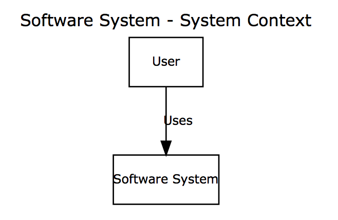

# Graphviz and DOT

Structurizr for Java also includes the ```structurizr-dot``` library, which in turn uses Cyrille Martraire's [dot-diagram library](https://github.com/LivingDocumentation/dot-diagram) to create DOT (graph description language) files that can be imported into the [Graphviz tool](http://www.graphviz.org).

Simply create your software architecture model and views as usual, and use the [DotWriter](https://github.com/structurizr/java/blob/master/structurizr-dot/src/com/structurizr/io/dot/DotWriter.java) class to export the views. [For example](https://github.com/structurizr/java/blob/master/structurizr-dot/src/com/structurizr/io/dot/DotWriterExample.java):

```java
Workspace workspace = new Workspace("Getting Started", "This is a model of my software system.");
Model model = workspace.getModel();

Person user = model.addPerson("User", "A user of my software system.");
SoftwareSystem softwareSystem = model.addSoftwareSystem("Software System", "My software system.");
user.uses(softwareSystem, "Uses");

ViewSet viewSet = workspace.getViews();
SystemContextView contextView = viewSet.createSystemContextView(softwareSystem, "SystemContext", "An example of a System Context diagram.");
contextView.addAllSoftwareSystems();
contextView.addAllPeople();

StringWriter stringWriter = new StringWriter();
DotWriter dotWriter = new DotWriter();
dotWriter.write(workspace, stringWriter);
System.out.println(stringWriter);
```

> You will need Graphviz installed.

This code will generate and output a DOT diagram definition that looks like this:

```
digraph G {
	graph [labelloc=top,label="Software System - System Context",fontname="Verdana",fontsize=12];
	edge [fontname="Verdana",fontsize=9,labelfontname="Verdana",labelfontsize=9];
	node [fontname="Verdana",fontsize=9,shape=record];
	c0 [label="User"]
	c1 [label="Software System"]
	// null
	c0 -> c1 [label="Uses"  , ];
}
```

Importing this graph definition into Graphviz (or [GraphvizFiddle](https://stamm-wilbrandt.de/GraphvizFiddle/)) gives you the following image:



## Benefits of using Graphviz with Structurizr

The key benefit of using Graphviz in conjunction with the Structurizr client library is that you can create diagrams from a __model__ of your software system. The model provides a set of rules that must be followed; related to elements, relationships, and how they are exposed using diagrams. This means:

1. Rather than looking after a collection of disjointed Graphviz diagram definitions, you can create many Graphviz diagrams from a single model and keep them all up to date easily, especially if integrated with your continuous build server and build pipeline.
1. The naming of elements and the definition of relationships between elements _remains consistent across diagrams_.
1. The software architecture model at the component level can be created by extracting components from a codebase, using _static analysis and reflection techniques_.

### Example

Here is a Graphviz version of the Component diagram from the [Spring PetClinic example](https://structurizr.com/share/1#components).

