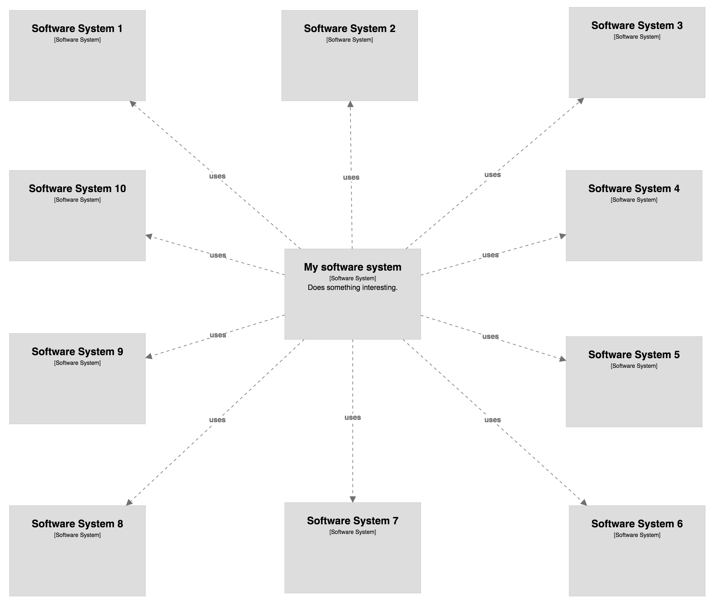

# Hiding relationships

Imagine you're modelling the software systems in a large organisation but you want to draw a system context view of a single software system in isolation. By default the resulting diagram will include all of the relationships between all elements included in the view. For example, the system context diagram for "My software system" (below) shows all of the software systems it's connected to, but it also shows the relationships between all of the other software systems too.


Perhaps we're really only interested in the direct relationships between "My software system" and other software systems in order to highlight the hub and spoke nature of the architecture. But the diagram shows all relationships, which adds clutter and noise. With Structurizr for Java, you can write some code like this to remove relationships that aren't connected to a specific software system.

```java
systemContextView.getRelationships().stream()
    .map(RelationshipView::getRelationship)
    .filter(r -> !r.getSource().equals(mySoftwareSystem) && !r.getDestination().equals(mySoftwareSystem))
    .forEach(view::removeRelationship);
```

The result of this is a simpler diagram that only includes direct relationships to/from "My software system".

