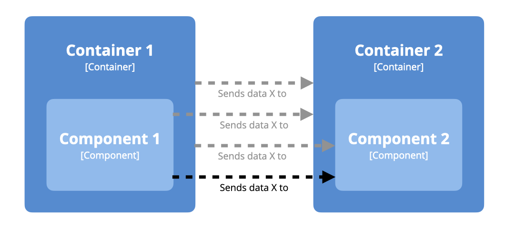

# Implied relationships

By default, the Structurizr for Java client library will not create implied relationships. For example, let's say that you have two components in different containers, and you create a relationship between them.

```
SoftwareSystem softwareSystem = model.addSoftwareSystem("Software System", "");
Container container1 = softwareSystem.addContainer("Container 1", "", "");
Component component1 = container1.addComponent("Component 1", "", "");

Container container2 = softwareSystem.addContainer("Container 2", "", "");
Component component2 = container2.addComponent("Component 2", "", "");

component1.uses(component2, "Sends data X to");
```

At this point, the model contains a single relationship between the two components, but there are three other implied relationships that could be added:



- Container 1 Sends data X to Component 2
- Component 1 Sends data X to Container 2
- Container 1 Sends data X to Container 2

To have the client library create these for you, set an ```ImpliedRelationshipsStrategy``` implementation on your model. Possible implementations are as follows.

## DefaultImpliedRelationshipsStrategy

This strategy does not create any implied relationships.

```
SoftwareSystem softwareSystem = model.addSoftwareSystem("Software System", "");
Container container1 = softwareSystem.addContainer("Container 1", "", "");
Component component1 = container1.addComponent("Component 1", "", "");

Container container2 = softwareSystem.addContainer("Container 2", "", "");
Component component2 = container2.addComponent("Component 2", "", "");

model.setImpliedRelationshipsStrategy(new DefaultImpliedRelationshipsStrategy()); // default
component1.uses(component2, "Sends data X to");
```

Relationships that exist in the model:

- Component 1 Sends data X to Component 2

## CreateImpliedRelationshipsUnlessSameRelationshipExistsStrategy

This strategy creates implied relationships between all valid combinations of the parent elements, unless the same relationship already exists between them.

```
SoftwareSystem softwareSystem = model.addSoftwareSystem("Software System", "");
Container container1 = softwareSystem.addContainer("Container 1", "", "");
Component component1 = container1.addComponent("Component 1", "", "");

Container container2 = softwareSystem.addContainer("Container 2", "", "");
Component component2 = container2.addComponent("Component 2", "", "");

model.setImpliedRelationshipsStrategy(new CreateImpliedRelationshipsUnlessAnyRelationshipExistsStrategy());
component1.uses(component2, "Sends data X to");
```

Relationships that exist in the model:

- Component 1 Sends data X to Component 2
- Component 1 Sends data X to Container 2
- Container 1 Sends data X to Component 2
- Container 1 Sends data X to Container 2

## CreateImpliedRelationshipsUnlessAnyRelationshipExistsStrategy

This strategy creates implied relationships between all valid combinations of the parent elements, unless *any* relationship already exists between them.

```
SoftwareSystem softwareSystem = model.addSoftwareSystem("Software System", "");
Container container1 = softwareSystem.addContainer("Container 1", "", "");
Component component1 = container1.addComponent("Component 1", "", "");

Container container2 = softwareSystem.addContainer("Container 2", "", "");
Component component2 = container2.addComponent("Component 2", "", "");

model.setImpliedRelationshipsStrategy(new CreateImpliedRelationshipsUnlessAnyRelationshipExistsStrategy());
container1.uses(container2, "Sends data to");
component1.uses(component2, "Sends data X to");
```

Relationships that exist in the model:

- Component 1 Sends data X to Component 2
- Component 1 Sends data X to Container 2
- Container 1 Sends data X to Component 2
- Container 1 Sends data to Container 2

This strategy is useful when you want to show a summary relationship at higher levels in the model, especially when multiple implied relationships could be created between elements.