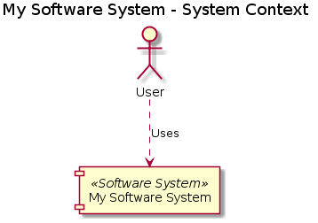
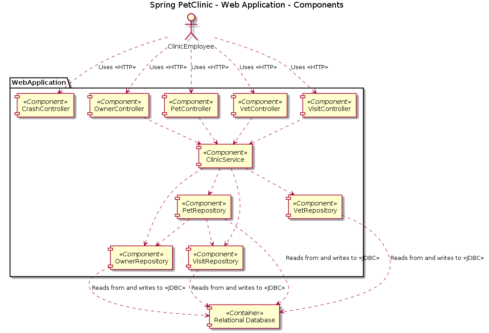

# PlantUML

Structurizr for Java also includes a simple exporter that can create diagram definitions compatible with [PlantUML](http://www.plantuml.com). The following diagram types are currently supported:

- System Context
- Container
- Component

Simply create your software architecture model and views as usual, and use the [PlantUMLWriter](https://github.com/structurizr/java/blob/master/structurizr-core/src/com/structurizr/io/plantuml/PlantUMLWriter.java) class to export the views. For example:

```java
Workspace workspace = new Workspace("PlantUML", "An example workspace that demonstrates the PlantUML writer.");
Model model = workspace.getModel();
ViewSet views = workspace.getViews();

SoftwareSystem softwareSystem = model.addSoftwareSystem("My Software System", "");
Person user = model.addPerson("User", "");
user.uses(softwareSystem, "Uses");

SystemContextView view = views.createSystemContextView(softwareSystem, "context", "A simple system context diagram.");
view.addAllElements();

StringWriter stringWriter = new StringWriter();
PlantUMLWriter plantUMLWriter = new PlantUMLWriter();
plantUMLWriter.write(workspace, stringWriter);
System.out.println(stringWriter.toString());
```

This code will generate and output a PlantUML diagram definition that looks like this:

```
@startuml
title My Software System - System Context
[My Software System] <<Software System>> as MySoftwareSystem
actor User
User ..> MySoftwareSystem : Uses
@enduml
```

If you copy/paste this into [PlantUML online](http://www.plantuml.com/plantuml/), you will get something like this:



## Benefits of using PlantUML with Structurizr

The key benefit of using PlantUML in conjunction with the Structurizr client library is that you can create diagrams from a __model__ of your software system. The model provides a set of rules that must be followed; related to elements, relationships, and how they are exposed using diagrams. This means:

1. Rather than looking after a collection of disjointed PlantUML diagram definitions, you can create many PlantUML diagrams from a single model and keep them all up to date easily, especially if integrated with your continous build server and build pipeline.
1. The naming of elements and the definition of relationships between elements _remains consistent across diagrams_.
1. The software architecture model at the component level can be created by extracting components from a codebase, using _static analysis and reflection techniques_. Here's a PlantUML version of the Spring PetClinic component diagram, the content of which has been [extracted from the code using the ComponentFinder](https://github.com/structurizr/java/blob/master/structurizr-examples/src/com/structurizr/example/spring/petclinic/SpringPetClinic.java#L56).


