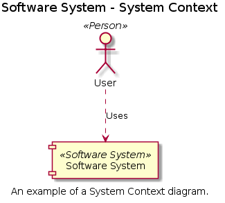
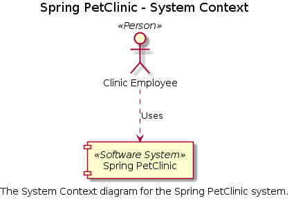
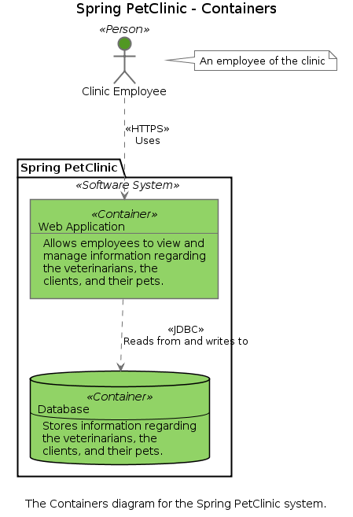
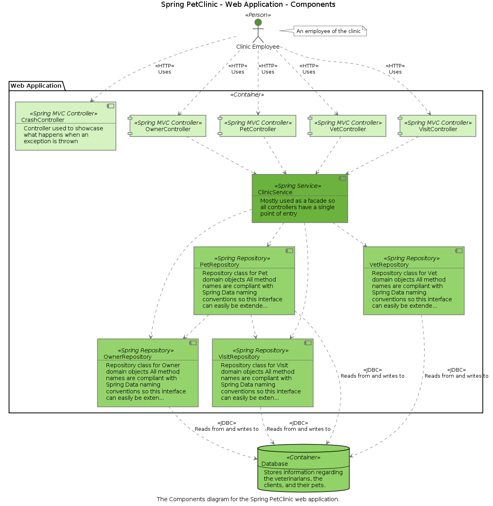
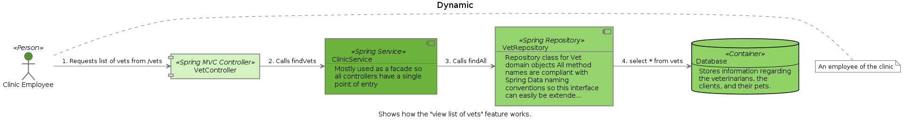
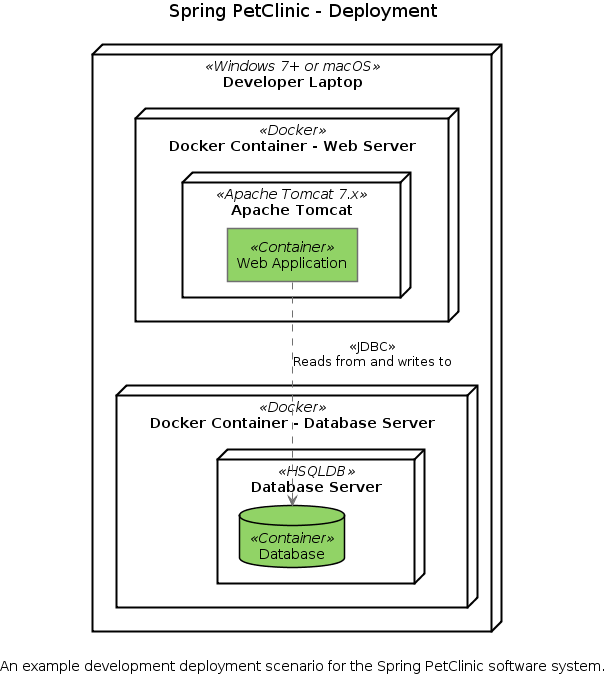
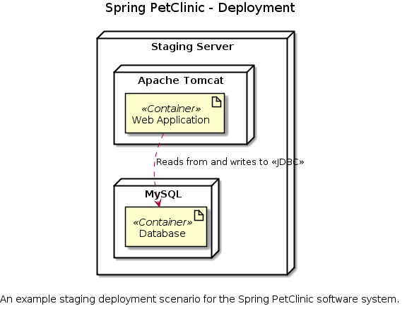
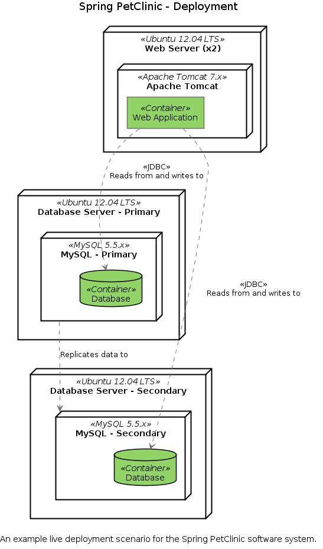

# PlantUML

Structurizr for Java also includes a simple exporter that can create diagram definitions compatible with [PlantUML](http://www.plantuml.com). The following diagram types are supported:

- Enterprise Context
- System Context
- Container
- Component
- Dynamic
- Deployment

Simply create your software architecture model and views as usual, and use the [PlantUMLWriter](https://github.com/structurizr/java/blob/master/structurizr-core/src/com/structurizr/io/plantuml/PlantUMLWriter.java) class to export the views. [For example](https://github.com/structurizr/java/blob/master/structurizr-examples/src/com/structurizr/example/plantuml/PlantUML.java):

```java
Workspace workspace = new Workspace("Getting Started", "This is a model of my software system.");
Model model = workspace.getModel();

Person user = model.addPerson("User", "A user of my software system.");
SoftwareSystem softwareSystem = model.addSoftwareSystem("Software System", "My software system.");
user.uses(softwareSystem, "Uses");

ViewSet viewSet = workspace.getViews();
SystemContextView contextView = viewSet.createSystemContextView(softwareSystem, "SystemContext", "An example of a System Context diagram.");
contextView.addAllSoftwareSystems();
contextView.addAllPeople();

StringWriter stringWriter = new StringWriter();
PlantUMLWriter plantUMLWriter = new PlantUMLWriter();
plantUMLWriter.write(workspace, stringWriter);
System.out.println(stringWriter.toString());
```

This code will generate and output a PlantUML diagram definition that looks like this:

```
@startuml
title Software System - System Context
caption An example of a System Context diagram.
component "Software System" <<Software System>> as 2
actor "User" <<Person>> as 1
1 ..> 2 : Uses
@enduml
```

If you copy/paste this into [PlantUML online](http://www.plantuml.com/plantuml/), you will get something like this:



## Benefits of using PlantUML with Structurizr

The key benefit of using PlantUML in conjunction with the Structurizr client library is that you can create diagrams from a __model__ of your software system. The model provides a set of rules that must be followed; related to elements, relationships, and how they are exposed using diagrams. This means:

1. Rather than looking after a collection of disjointed PlantUML diagram definitions, you can create many PlantUML diagrams from a single model and keep them all up to date easily, especially if integrated with your continuous build server and build pipeline.
1. The naming of elements and the definition of relationships between elements _remains consistent across diagrams_.
1. The software architecture model at the component level can be created by extracting components from a codebase, using _static analysis and reflection techniques_.

### Example

Here are the PlantUML versions of the diagrams from the [Spring PetClinic example](https://structurizr.com/share/1).














