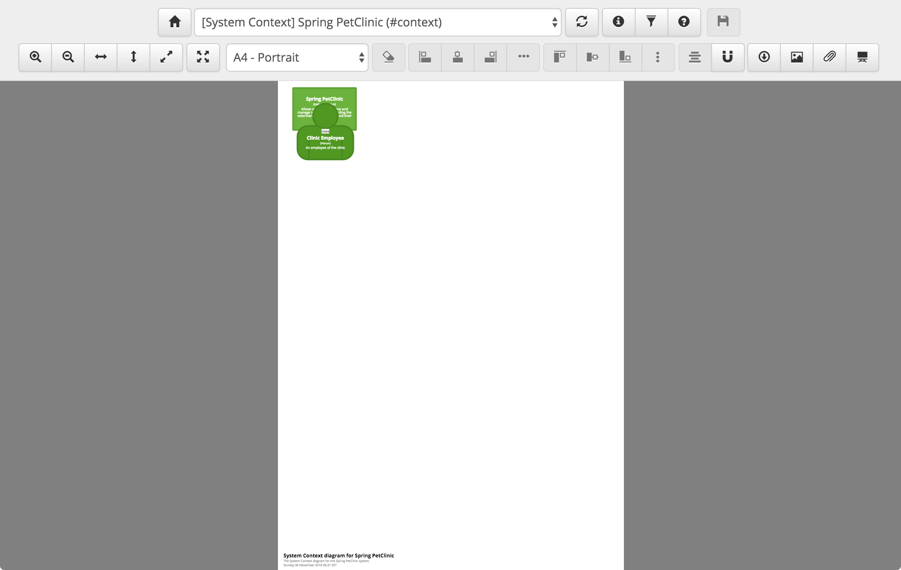

# The Spring PetClinic example

This is a step-by-step guide to recreating the System Context, Container and Component diagrams from the [Spring PetClinic example](https://structurizr.com/share/1), which are based upon the original version of the application. It assumes that you have working Java, Maven and git installations plus a development environment to write code. The full source code for this example can be found in [SpringPetClinic.java](https://github.com/structurizr/java/blob/master/structurizr-examples/src/com/structurizr/example/SpringPetClinic.java). 

## 1. Clone and build the Spring PetClinic code

First of all, we need to download a copy of the [Spring PetClinic source code](https://github.com/spring-projects/spring-petclinic/). Please note that this example was created with a specific version of the Spring PetClinic codebase, so please be sure to perform the ```git checkout``` step too.

```
git clone https://github.com/spring-projects/spring-petclinic.git
cd spring-petclinic
git checkout 95de1d9f8bf63560915331664b27a4a75ce1f1f6
```

Next we need to run the build.

```
mvn
```

The Spring PetClinic is a sample application and includes three persistence implementations (JDBC, JPA and Spring Data) that all do the same thing. As this is unrealistic for most applications, let's make things easier by removing the JPA and Spring Data implementations.

```
rm -r target/spring-petclinic-1.0.0-SNAPSHOT/WEB-INF/classes/org/springframework/samples/petclinic/repository/jpa/
rm -r target/spring-petclinic-1.0.0-SNAPSHOT/WEB-INF/classes/org/springframework/samples/petclinic/repository/springdatajpa/
```

## 2. Create a model

With the Spring PetClinic application built, we now need to create a software architecture model using the [extract and supplement](https://structurizr.com/help/extract-and-supplement) approach. We will do this by creating a simple Java program to create the model. The Maven, Gradle, etc dependencies you will need are as follows:

Name                                     | Description
---------------------------------------- | ---------------------------------------------------------------------------------------------------------------------------
com.structurizr:structurizr-client:1.3.1 | The Structurizr API client library.
com.structurizr:structurizr-spring:1.3.1 | The Spring component finder.

First we need to create a little boilerplate code to create a workspace and a model.

```java
public static void main(String[] args) throws Exception {
    Workspace workspace = new Workspace("Spring PetClinic",
        "This is a C4 representation of the Spring PetClinic sample app (https://github.com/spring-projects/spring-petclinic/)");
    Model model = workspace.getModel();
```

## 3. People and software systems

A system context diagram for the Spring PetClinic system would simply consist of a single type of user (a clinic employee) using the Spring PetClinic system. With Structurizr for Java, we can represent this in code as follows.

```java
SoftwareSystem springPetClinic = model.addSoftwareSystem("Spring PetClinic",
    "Allows employees to view and manage information regarding the veterinarians, the clients, and their pets.");
Person clinicEmployee = model.addPerson("Clinic Employee", "An employee of the clinic");

clinicEmployee.uses(springPetClinic, "Uses");
```

### 4. Containers

Stepping down to containers, the Spring PetClinic system is made up of a Java web application that uses a database to store data. If we make some assumptions about the deployment technology stack, we can represent this in code as follows.

```java
Container webApplication = springPetClinic.addContainer("Web Application",
    "Allows employees to view and manage information regarding the veterinarians, the clients, and their pets.",
    "Java and Spring");
Container relationalDatabase = springPetClinic.addContainer("Relational Database",
    "Stores information regarding the veterinarians, the clients, and their pets.",
    "Relational Database Schema");

clinicEmployee.uses(webApplication, "Uses", "HTTPS");
webApplication.uses(relationalDatabase, "Reads from and writes to", "JDBC");
```

## 5. Components

At the next level of abstraction, we need to open up the web application to see the components inside it. Although we couldn't really get the two previous levels of abstraction from the codebase easily, we *can* get the components. All we need to do is [understand what a "component" means in the context of this codebase](https://structurizr.com/help/components-vs-classes). We can then use this information to help us find and extract them in order to populate the software architecture model.

Spring MVC uses Java annotations (```@Controller```, ```@Service``` and ```@Repository```) to signify classes as being web controllers, services and repositories respectively. Assuming that we consider these to be our architecturally significant code elements, it's then a simple job of extracting these annotated classes (Spring Beans) from the codebase.

```java
ComponentFinder componentFinder = new ComponentFinder(
    webApplication, "org.springframework.samples.petclinic",
    new SpringComponentFinderStrategy(
            new ReferencedTypesSupportingTypesStrategy(false)
    ),
    new SourceCodeComponentFinderStrategy(new File(sourceRoot, "/src/main/java/"), 150));

componentFinder.findComponents();
```

The ```SpringComponentFinderStrategy``` is a pre-built component finder strategy that understands how applications are built with Spring and how to identify Spring components, such as MVC controllers, REST controllers, services, repositories, JPA repositories, etc. The way that you identify supporting types (i.e. the Java classes and interfaces) that implement a component is also pluggable. Here, with the ```ReferencedTypesSupportingTypesStrategy```, we're looking for all types directly referenced by the component type(s). See [Components and supporting types](supporting-types.md) for more details about this.

Once the components and their supporting types have been identified, the dependencies between components are also identified and extracted.

In addition, the ```SourceCodeComponentFinderStrategy``` will parse the top-level Javadoc comment from the source file for each component type for inclusion in the model. It will also calculate the size of each component based upon the number of lines of source code across all supporting types.

The final thing we need to do is connect the user to the web controllers, and the repositories to the database. This is easy to do since the software architecture model is represented in code.

```java
webApplication.getComponents().stream()
    .filter(c -> c.getTechnology().equals(SpringComponentFinderStrategy.SPRING_MVC_CONTROLLER))
    .forEach(c -> clinicEmployee.uses(c, "Uses", "HTTP"));

webApplication.getComponents().stream()
    .filter(c -> c.getTechnology().equals(SpringComponentFinderStrategy.SPRING_REPOSITORY))
    .forEach(c -> c.uses(relationalDatabase, "Reads from and writes to", "JDBC"));
```

## 6. Create some views

With the software architecture model in place, we now need to create some views with which to visualise the model. Again, we can do this using code. First the context diagram, which includes all people and all software systems.

```java
ViewSet viewSet = workspace.getViews();
SystemContextView contextView = viewSet.createSystemContextView(springPetClinic, "context", "Context view for Spring PetClinic");
contextView.addAllSoftwareSystems();
contextView.addAllPeople();
```

Next is the container diagram.

```java
ContainerView containerView = viewSet.createContainerView(springPetClinic, "containers", "Container view for Spring PetClinic");
containerView.addAllPeople();
containerView.addAllSoftwareSystems();
containerView.addAllContainers();
```

And finally is the component diagram.

```java
ComponentView componentView = viewSet.createComponentView(webApplication, "components", "The Components diagram for the Spring PetClinic web application.");
componentView.addAllComponents();
componentView.addAllPeople();
componentView.add(relationalDatabase);
```

## 7. Linking elements to external resources

In order to create a set of maps for the Spring PetClinic system that reflect reality, we can link the components on the component diagram to the source code. This isn't necessary, but doing so means that we can [navigate from the diagrams to the code](https://structurizr.com/help/diagram-navigation).
 
```java
for (Component component : webApplication.getComponents()) {
	for (CodeElement codeElement : component.getCode()) {
    	String sourcePath = codeElement.getUrl();
       	if (sourcePath != null) {
           	codeElement.setUrl(sourcePath.replace(
               	sourceRoot.toURI().toString(),
               	"https://github.com/spring-projects/spring-petclinic/tree/864580702f8ef4d2cdfd7fe4497fb8c9e86018d2/"));
		}
	}
}
```

Since we don't have a component model for the database, let's instead simply link the database element to the data definition language in GitHub.

```java
relationalDatabase.setUrl("https://github.com/spring-projects/spring-petclinic/tree/master/src/main/resources/db/hsqldb");
```

## 8. Styling the diagrams

By default, Structurizr will render all of the elements as grey boxes. However, the elements and relationships can be styled.

```java
springPetClinic.addTags("Spring PetClinic");
webApplication.getComponents().stream().filter(c -> c.getTechnology().equals(SpringComponentFinderStrategy.SPRING_MVC_CONTROLLER))
    .forEach(c -> c.addTags("Spring MVC Controller"));
webApplication.getComponents().stream().filter(c -> c.getTechnology().equals(SpringComponentFinderStrategy.SPRING_SERVICE))
    .forEach(c -> c.addTags("Spring Service"));
webApplication.getComponents().stream().filter(c -> c.getTechnology().equals(SpringComponentFinderStrategy.SPRING_REPOSITORY))
    .forEach(c -> c.addTags("Spring Repository"));
relationalDatabase.addTags("Database");

Styles styles = viewSet.getConfiguration().getStyles();
styles.addElementStyle("Spring PetClinic").background("#6CB33E").color("#ffffff");
styles.addElementStyle(Tags.PERSON).background("#519823").color("#ffffff").shape(Shape.Person);
styles.addElementStyle(Tags.CONTAINER).background("#91D366").color("#ffffff");
styles.addElementStyle("Database").shape(Shape.Cylinder);
styles.addElementStyle("Spring MVC Controller").background("#D4F3C0").color("#000000");
styles.addElementStyle("Spring Service").background("#6CB33E").color("#000000");
styles.addElementStyle("Spring Repository").background("#95D46C").color("#000000");
```

## 9. Upload the model and views to Structurizr

The code we've just seen simply creates an in-memory representation of the software architecture model, in this case as a collection of Java objects. The open source Structurizr for Java library also includes a way to export this model to an intermediate JSON representation, which can then be imported into some tooling that is able to visualise it. This is what Structurizr does.

```java
StructurizrClient structurizrClient = new StructurizrClient("key", "secret");
structurizrClient.putWorkspace(1234, workspace);
```

In order to upload your model to Structurizr using the web API, you'll need to [sign up](https://structurizr.com/signup) to get your own API key and secret.
Also, when you run the Structurizr program you just created, you'll need to ensure that the compiled version of the Spring PetClinic application is on your classpath; specifically these directories:

```
target/spring-petclinic-1.0.0-SNAPSHOT/WEB-INF/classes
target/spring-petclinic-1.0.0-SNAPSHOT/WEB-INF/lib
```

## 10. View the diagrams and layout the elements

If you sign in to Structurizr and open the workspace you just uploaded, you'll see something like this.



Structurizr doesn't do any automatic layout of the elements on your diagrams, so you will need to drag the boxes around to create a layout that you like. Here are the links to the live example diagrams:

- [System Context diagram](https://structurizr.com/share/1#context)
- [Container diagram](https://structurizr.com/share/1#containers)
- [Component diagram](https://structurizr.com/share/1#components)

## 11. Explore the model
Once you have a model of your software system, you can explore it using a number of different visualisations. For example:

- [Static structure, rendered as a tree](https://structurizr.com/share/1/explore/tree)
- [Static structure, rendered as circles based upon size](https://structurizr.com/share/1/explore/size-circles)
- [Component dependencies](https://structurizr.com/share/1/explore/component-dependencies)
- [Component and code dependencies](https://structurizr.com/share/1/explore/component-and-code-dependencies)

