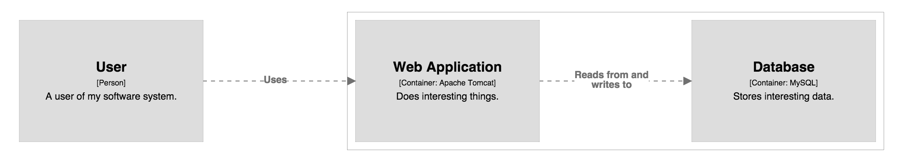
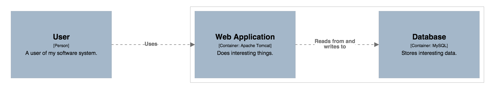
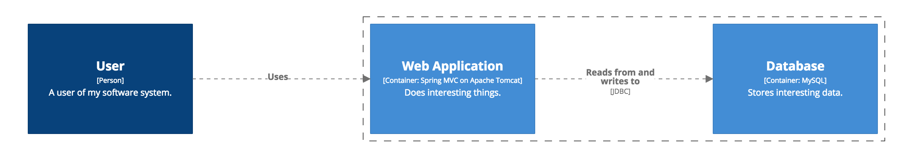
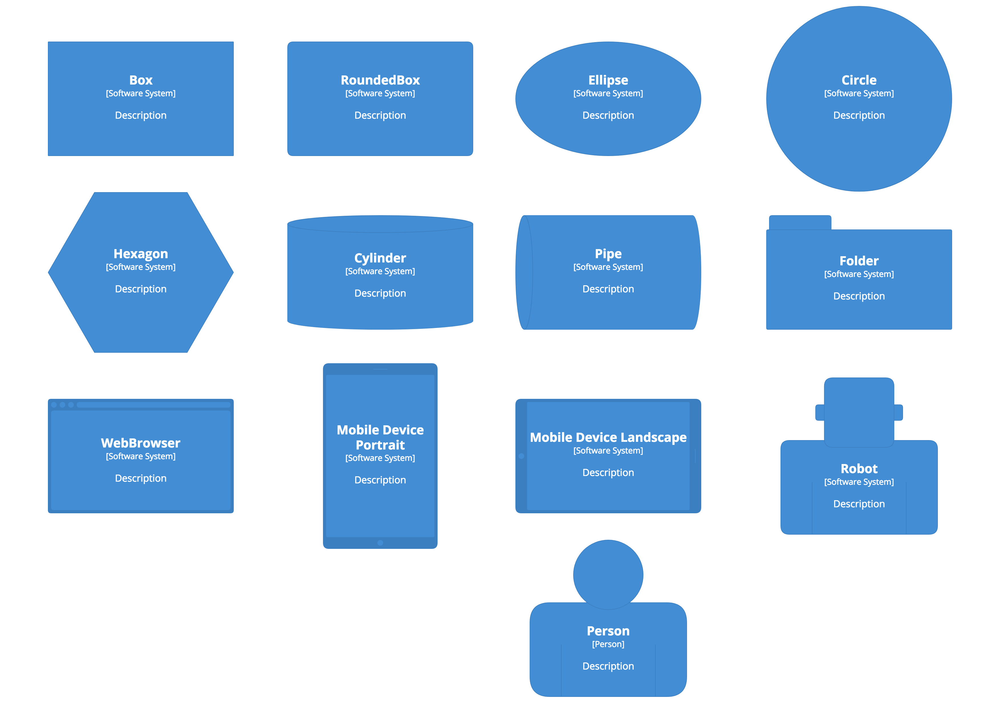

# Styling elements

By default, all model elements are rendered as grey boxes as shown in the example diagram below.



However, the following characteristics of the elements can be customized:

- Width (pixels)
- Height (pixels)
- Background colour (HTML hex value)
- Text colour (HTML hex value)
- Font size (pixels)
- Shape (Box, rounded box, cylinder, folder, person - [Structurizr paid plans only](https://structurizr.com/pricing))

## Tagging elements

All elements within a software architecture model can have one or more tags associated with them. A tag is simply a free-format string. By default, the Java client library adds the following tags to elements.

Element | Tags
------- | ----
Software System | "Element", "Software System"
Person | "Element", "Person"
Container | "Element", "Container"
Component | "Element", "Component"

All of these tags are defined as constants in the [Tags](https://github.com/structurizr/java/blob/master/structurizr-core/src/com/structurizr/model/Tags.java) class. You can add your own custom tags to elements using the ```addTags()``` method on the element.

## Colour

To style an element, simply create an [ElementStyle](https://github.com/structurizr/java/blob/master/structurizr-core/src/com/structurizr/view/ElementStyle.java) for a particular tag and specify the characteristics that you would like to change. For example, you can change the colour of all elements as follows.

```java
Styles styles = workspace.getViews().getConfiguration().getStyles();
styles.addElementStyle(Tags.ELEMENT).background("#a4b7c9").color("#000000");
```

 
 
You can also change the colour of specific elements, for example based upon their type, as follows.

```java
Styles styles = workspace.getViews().getConfiguration().getStyles();
styles.addElementStyle(Tags.PERSON).background("#728da5").color("#ffffff");
styles.addElementStyle(Tags.CONTAINER).background("#2a4e6e").color("#ffffff");
```



> If you're looking for a colour scheme for your diagrams, try the [Adobe Color Wheel](https://color.adobe.com/create/color-wheel/) or [Paletton](http://paletton.com).

## Shapes

Subscribers to a [Structurizr paid plan](https://structurizr.com/pricing) can also style elements using different shapes as follows.

```java
Styles styles = workspace.getViews().getConfiguration().getStyles();
styles.addElementStyle(Tags.PERSON).background("#728da5").color("#ffffff").shape(Shape.Person);
styles.addElementStyle(Tags.CONTAINER).background("#2a4e6e").color("#ffffff");
database.addTags("Database");
styles.addElementStyle("Database").shape(Shape.Cylinder);
```


As with CSS, styles cascade according to the order in which they are added. In the example above, the database element is coloured using the "Container" style, the shape of which is overriden by the "Database" style.

## Diagram key

[Structurizr](https://structurizr.com) will automatically add all element styles to a diagram key.

