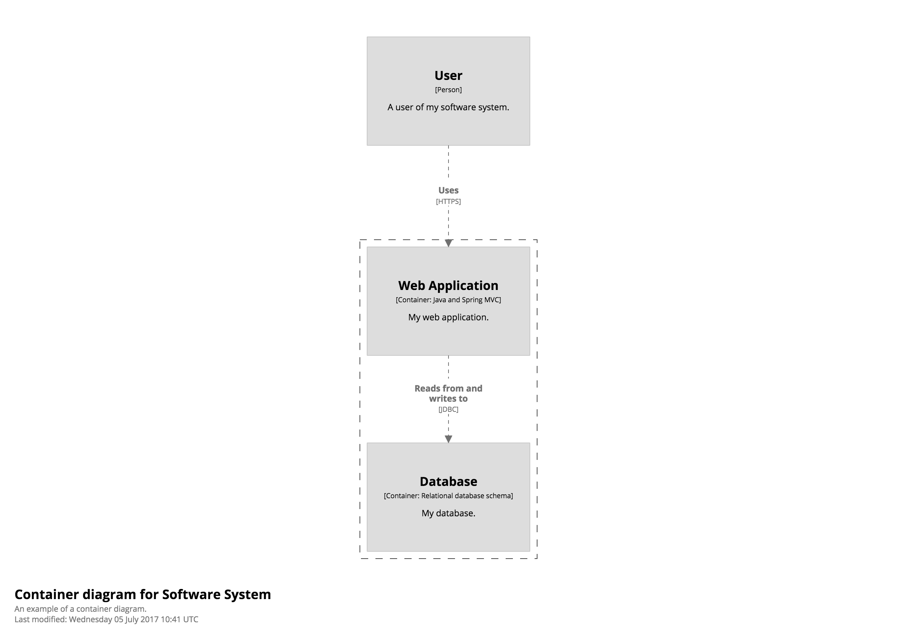
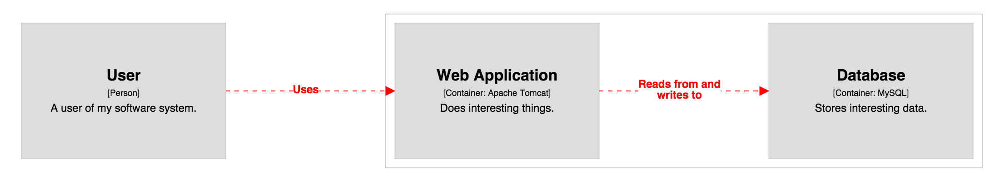
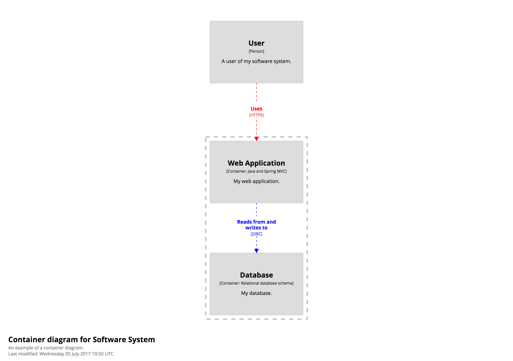
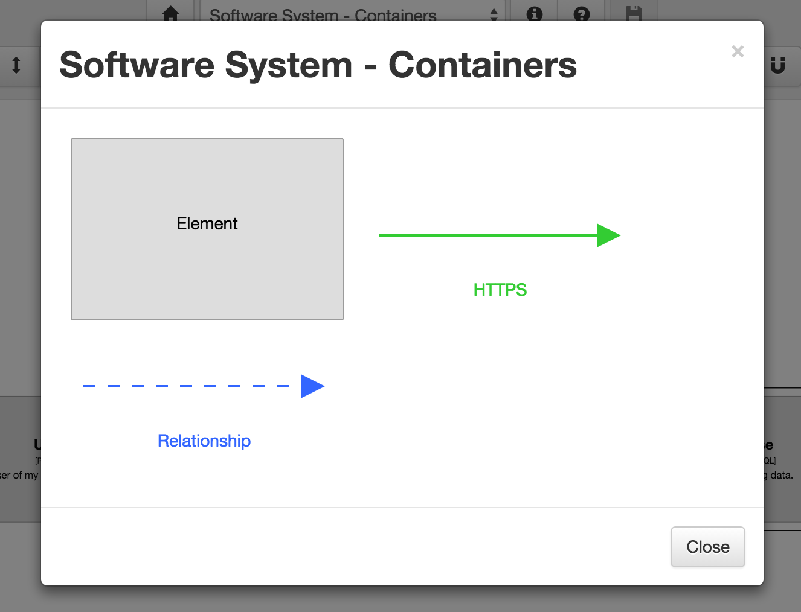

# Styling relationships

By default, all relationships are rendered as dashed grey lines as shown in the example diagram below.



However, the following characteristics of the relationships can be customized:

- Line thickness (pixels)
- Colour (HTML hex value)
- Line style (dashed or solid)
- Routing (direct or orthogonal)
- Font size (pixels)
- Width (of the description, in pixels)
- Position (of the description along the line, as a percentage from start to end)
- Opacity (an integer between 0 and 100)

## Tagging relationships

All relationships within a software architecture model can have one or more tags associated with them. A tag is simply a free-format string. By default, the Java client library adds the ```"Relationship"``` tag to relationships. As we'll see shortly, you can add your own custom tags to relationships using the ```addTags()``` method on the relationship.

## Colour

To style a relationship, simply create a [RelationshipStyle](https://github.com/structurizr/java/blob/master/structurizr-core/src/com/structurizr/view/RelationshipStyle.java) for a particular tag and specify the characteristics that you would like to change. For example, you can change the colour of all relationships as follows.

```java
Styles styles = workspace.getViews().getConfiguration().getStyles();
styles.addRelationshipStyle(Tags.RELATIONSHIP).color("#ff0000");
```



You can also change the colour of specific relationships, based upon their tag, as follows.

```java
model.getRelationships().stream().filter(r -> "HTTPS".equals(r.getTechnology())).forEach(r -> r.addTags("HTTPS"));
model.getRelationships().stream().filter(r -> "JDBC".equals(r.getTechnology())).forEach(r -> r.addTags("JDBC"));
styles.addRelationshipStyle("HTTPS").color("#ff0000");
styles.addRelationshipStyle("JDBC").color("#0000ff");
```



## Diagram key

[Structurizr](https://structurizr.com) will automatically add all relationship styles to a diagram key.




You can find the code for this example at [StylingRelationships.java](https://github.com/structurizr/java/blob/master/structurizr-examples/src/com/structurizr/example/core/StylingRelationships.java) and the live example workspace at [https://structurizr.com/share/36131](https://structurizr.com/share/36131).