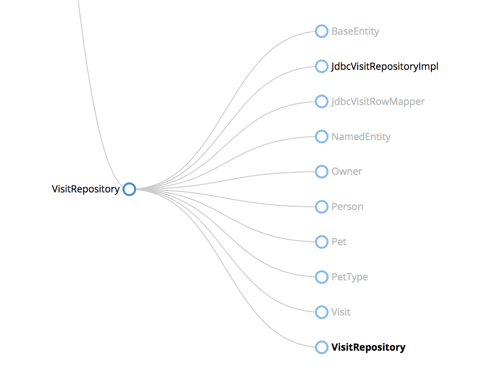
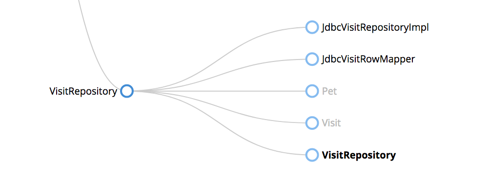
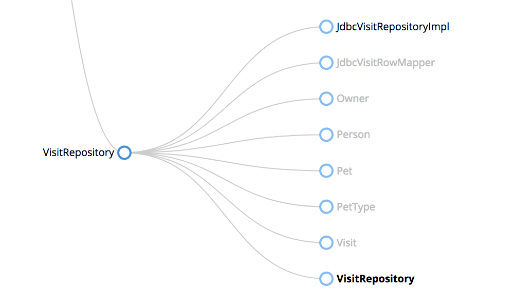
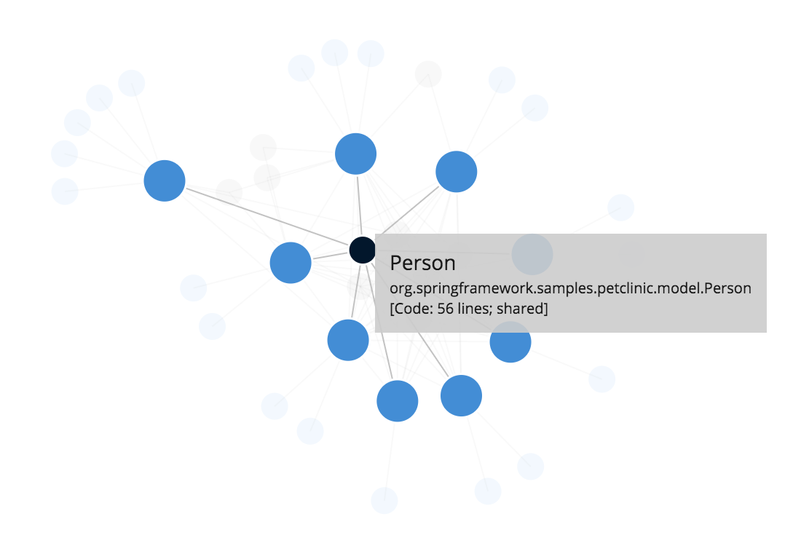
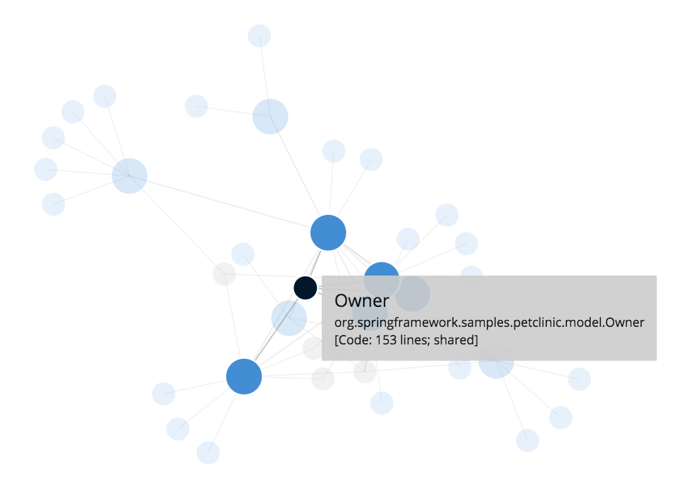

# Components and supporting types

In Structurizr, a [Component](https://github.com/structurizr/java/blob/master/structurizr-core/src/com/structurizr/model/Component.java) is described by a number of properties and can have a number of [CodeElement](https://github.com/structurizr/java/blob/master/structurizr-core/src/com/structurizr/model/CodeElement.java)s associated with it that represent the Java classes and interfaces that implement and/or support that component.

Because each codebase is different, the mechanism to find a component's supporting types is pluggable via a number of strategies ([SupportingTypesStrategy](https://github.com/structurizr/java/blob/master/structurizr-core/src/com/structurizr/analysis/SupportingTypesStrategy.java)), which can be used in combination. Let's look at the [Spring PetClinic example](spring-petclinic.md) to see how the various supporting types strategies affect the software architecture model.

## 1. No supporting types strategy

This simple example uses the SpringComponentFinderStrategy with no supporting types strategy.

```java
ComponentFinder componentFinder = new ComponentFinder(
    webApplication, "org.springframework.samples.petclinic",
    new SpringComponentFinderStrategy(),
    new SourceCodeComponentFinderStrategy(new File(sourceRoot, "/src/main/java/"), 150));

componentFinder.findComponents();
```

When executed against the compiled version of the Spring PetClinic codebase, each component identified will be made up of only the types found by the component finder strategy. For example, the ```VisitRepository``` component will be made up of an interface (```VisitRepository```) and the implementation class (```JdbcVisitRepositoryImpl```). You can visualise this using [Structurizr's tree exploration](https://structurizr.com/help/explorations).


 
## 2. Referenced types in the same package

Next, let's use the [ReferencedTypesInSamePackageSupportingTypesStrategy](https://github.com/structurizr/java/blob/master/structurizr-core/src/com/structurizr/analysis/ReferencedTypesInSamePackageSupportingTypesStrategy.java) to find all supporting types in the same package as the component type. This is particularly useful when each component neatly resides in its own Java package, and you aren't interested in any other code outside of this package.

```java
ComponentFinder componentFinder = new ComponentFinder(
    webApplication, "org.springframework.samples.petclinic",
    new SpringComponentFinderStrategy(
            new ReferencedTypesInSamePackageSupportingTypesStrategy()
    ),
    new SourceCodeComponentFinderStrategy(new File(sourceRoot, "/src/main/java/"), 150));

componentFinder.findComponents();
```

This strategy finds all of the supporting types that are referenced by the types found by the component finder strategy. In real terms, we've now additionally picked up the ```JdbcVisitRowMapper``` class, since this is used by the ```JdbcVisitRepositoryImpl``` class.


## 3. All referenced types

Next, let's use the [ReferencedTypesSupportingTypesStrategy](https://github.com/structurizr/java/blob/master/structurizr-core/src/com/structurizr/analysis/ReferencedTypesSupportingTypesStrategy.java) to find all of the referenced types, irrespective of which package they reside in, provided that package sits somewhere underneath ```org.springframework.samples.petclinic```.

```java
ComponentFinder componentFinder = new ComponentFinder(
    webApplication, "org.springframework.samples.petclinic",
    new SpringComponentFinderStrategy(
            new ReferencedTypesSupportingTypesStrategy()
    ),
    new SourceCodeComponentFinderStrategy(new File(sourceRoot, "/src/main/java/"), 150));

componentFinder.findComponents();
```

As the following image illustrates, we now have many more classes that are supporting the implementation of the ```VisitRepository``` component.



This collection of classes may look confusing at first, but the ```JdbcVisitRepositoryImpl``` class references the ```Visit``` class, which in turn references the ```Pet``` class, which in turn references the ```Owner``` class, etc. The Structurizr tree exploration shows that these classes are shared between the ```VisitRepository``` and other components by rendering their names in grey.

## 4. Directly referenced types only

Of course, the ```JdbcVisitRepositoryImpl``` class may not actually use all of these classes, but they are certainly available to it. This is one of the drawbacks of using static analysis based upon compiled bytecode. You can modify this behaviour and find only those types directly referenced by the component by passing ```false``` to the constructor of the [ReferencedTypesSupportingTypesStrategy](https://github.com/structurizr/java/blob/master/structurizr-core/src/com/structurizr/analysis/ReferencedTypesSupportingTypesStrategy.java).



## Excluding types

The Structurizr ```ComponentFinder``` will also allow you to exclude types from the component scanning process using one or more regular expressions. If we wanted to exclude the ```BaseEntity``` and ```NamedEntity``` classes in one of the previous examples, we could add the following line of code before calling ```componentFinder.findComponents()```.

```
componentFinder.exclude("org\\.springframework\\.samples\\.petclinic\\.model\\..*Entity");
```

The result is as follows.



## Type erasure

The implementation of the various supporting types strategies above use reflection based upon Java bytecode. For this reason, the results are subject to the rules around Java's [type erasure](https://docs.oracle.com/javase/tutorial/java/generics/erasure.html). For example, if you have a component that references ```Collection<Customer>``` in method signatures, you may find ```Customer``` missing from the list of supporting types.

## Visualising shared code

The easiest way to analyse the component-code relationships is to visualise them. Structurizr has a number of built-in explorations that can help with this.

### Component size

[Structurizr's component size exploration](https://structurizr.com/share/1/explore/size-circles) renders components and code elements as a collection of nested circles, where the size of each circle is based upon the number of lines of code. Shared code elements are rendered using a different style, and hovering the mouse over a shared code element will highlight all other occurrences. This allows you to easily see where code elements (interfaces and classes) are shared between components.


### Component and code dependencies

The [component and code dependency exploration](https://structurizr.com/share/1/explore/component-and-code-dependencies) renders a force-directed graph of the components and code elements, along with all of the relationships between them. Shared code elements are rendered in grey.



Clicking any node will allow you to easily see which other nodes are directly connected to it.


