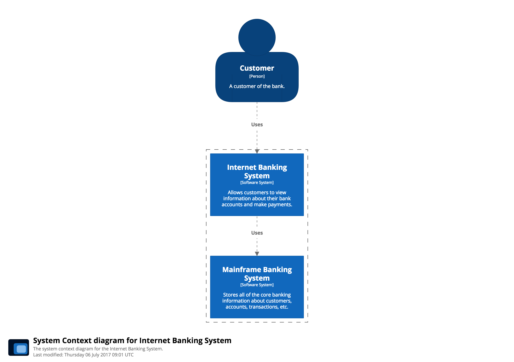

# System Context diagram

A System Context diagram is a good starting point for diagramming and documenting a software system, allowing you to step back and see the big picture. Draw a diagram showing your system as a box in the centre, surrounded by its users and the other systems that it interacts with.

Detail isn't important here as this is your zoomed out view showing a big picture of the system landscape. The focus should be on people (actors, roles, personas, etc) and software systems rather than technologies, protocols and other low-level details. It's the sort of diagram that you could show to non-technical people.

## Example

This is an example System Context diagram for a fictional Internet Banking System. It shows the people who use it, and the other software systems that the Internet Banking System has a relationship with. Personal Customers of the bank use the Internet Banking System to view information about their bank accounts, and to make payments. The Internet Banking System itself uses the bank's existing Mainframe Banking System to do this, and uses the bank's existing E-mail System to send e-mails to customers.

See [InternetBankingSystem.java](https://github.com/structurizr/examples/blob/main/java/src/main/java/com/structurizr/example/bigbankplc/InternetBankingSystem.java) for the code, and [https://structurizr.com/share/36141/diagrams#SystemContext](https://structurizr.com/share/36141/diagrams#SystemContext) for the diagram.