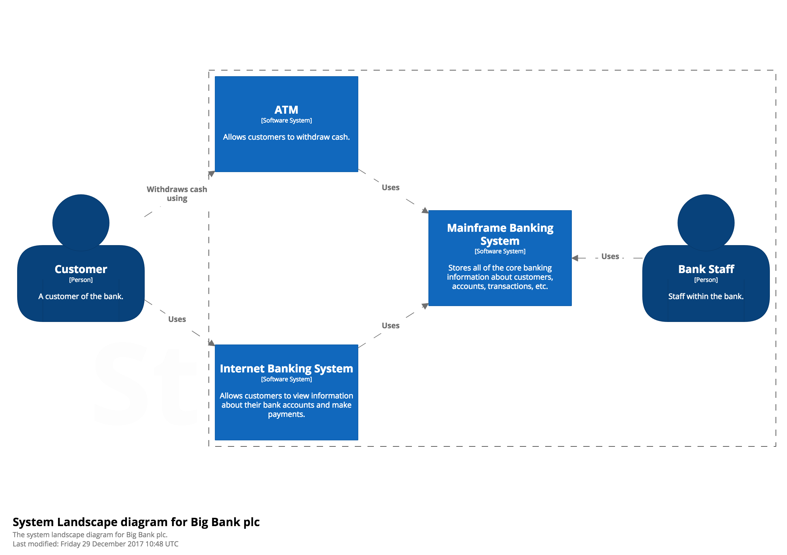

# System Landscape diagram

The C4 model provides a static view of a single software system but, in the real-world, software systems never live in isolation. For this reason, and particularly if you are responsible for a collection of software systems, it's often useful to understand how all of these software systems fit together within the bounds of an enterprise. To do this, simply add another diagram that sits "on top" of the C4 diagrams, to show the system landscape from an IT perspective. Like the System Context diagram, this diagram can show the organisational boundary, internal/external users and internal/external systems.

Essentially this is a high-level map of the software systems at the enterprise level, with a C4 drill-down for each software system of interest. From a practical perspective, a system landscape diagram is really just a system context diagram without a specific focus on a particular software system.

## Example

As an example, a System Landscape diagram for a simplified, fictional bank might look something like this.

See [SystemLandscape.java](https://github.com/structurizr/examples/blob/main/java/src/main/java/com/structurizr/example/bigbankplc/SystemLandscape.java) for the code, and [https://structurizr.com/share/28201/diagrams#SystemLandscape](https://structurizr.com/share/28201/diagrams#SystemLandscape) for the diagram.