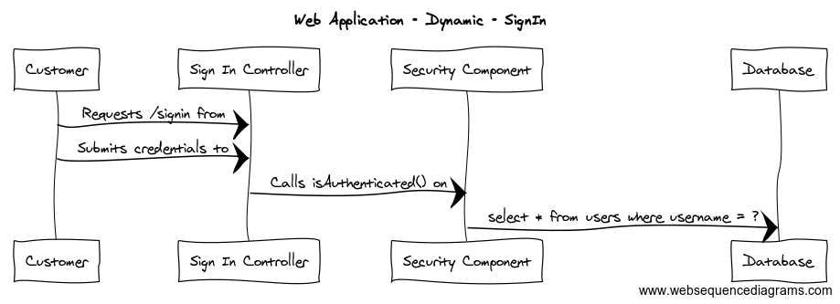

# WebSequenceDiagrams

Structurizr for Java also includes a simple exporter that can create [dynamic diagram](dynamic-diagram.md) definitions compatible with [WebSequenceDiagrams](https://www.websequencediagrams.com).

Simply create your software architecture model and views as usual, and use the [WebSequenceDiagramsWriter](https://github.com/structurizr/java/blob/master/structurizr-websequencediagrams/src/com/structurizr/io/websequencediagrams/WebSequenceDiagramsWriter.java) class to export the dynamic views and generate WebSequenceDiagrams diagram definitions. A WebSequenceDiagram version of the [Big Bank plc dynamic diagram](dynamic-diagram.md) looks something like this:

```
title Web Application - Dynamic - SignIn

Customer->Sign In Controller: Requests /signin from
Customer->Sign In Controller: Submits credentials to
Sign In Controller->Security Component: Calls isAuthenticated() on
Security Component->Database: select * from users where username = ?
```

If you copy/paste this into [WebSequenceDiagrams](https://www.websequencediagrams.com), you will get something like this:

